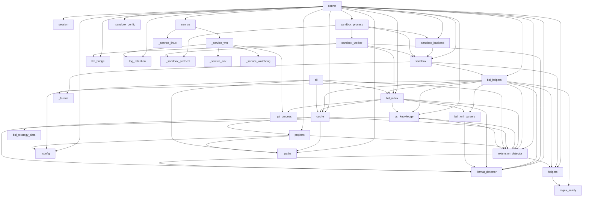

# Карта модулей

Актуально для **v1.36.0** (`BUILDER_VERSION = 15`). Переход **1.35.2 → 1.36.0 пересборки НЕ требует** — релиз read-time: схема SQLite, `BUILDER_VERSION`, формат данных индекса и ВЫХОД билдера не тронуты, новых таблиц и колонок нет. Всё новое читается из уже существующих `subsystem_content`, `file_paths`, `object_synonyms` и `functional_options`; добавлен один read-only метод ридера (`IndexReader.get_subsystem_lookup`) и параллельный режим ФАЙЛОВОГО обхода живого каталога — оба поверх неизменного формата. Переход **1.35.1 → 1.35.2 пересборки НЕ требует** — релиз про наблюдаемость окружения: схема, `BUILDER_VERSION`, формат данных индекса и выход билдера не тронуты, состав и контракты хелперов не менялись. Переход **1.35.0 → 1.35.1 пересборки НЕ требует** — изменён только watchdog Windows-службы, индекса релиз не касается. Переход **1.33.x → 1.35.0 пересборки НЕ требует** — релиз read-time: схема SQLite, `BUILDER_VERSION`, формат данных индекса и ВЫХОД билдера не изменены. Две функции обхода метаданных (`_iter_metadata_xml_files`, `_collect_object_synonyms`) общие у сборщика и read-time-хелперов и получили НЕОБЯЗАТЕЛЬНЫЙ приватный status-канал; при `_status=None` исполняется прежняя ветка — тот же цикл по тем же кандидатам, состав и порядок строк сверены с до-релизной реализацией. Для перехода **1.33.0 → 1.33.1 пересборка НЕ нужна** — менялся только жизненный цикл процессов `git`, индексные данные не затронуты. При обновлении с версий **ниже 1.33.0** обязательная полная пересборка на v15 остаётся в силе: схема та же, но содержимое `methods` / `register_movements` / `form_elements` / `metadata_references` пересчитывается.

Числа-снимки ниже застолблены тестами — если правишь сущность, обнови и число, и тест:

| Что | Значение | Где проверяется |
|---|---|---|
| Хелперов в песочнице (`_reg`) | **55** (discovery 8, code 12, xml 5, composite 8, business 16, extension 3, navigation 3) | `tests/test_start_cost_budget.py::test_helper_snapshot_count_locked` |
| Схема индекса | **v15**, 27 таблиц + FTS5 | `BUILDER_VERSION` в `bsl_index.py` |
| Бизнес-домены / алиасы (`rlm_help(topic=…)`) | **16** доменов, **116** алиасов | `_BUSINESS_RECIPES` / `_RECIPE_ALIASES` |
| Секции стратегии (`rlm_help(section=…)`) | **5** (+ виртуальная `disambiguation`) | `tests/test_strategy_data.py::test_strategy_sections_keys` |
| Пары DISAMBIGUATION | **14** | `tests/test_strategy_data.py::test_disambiguation_pairs_count` + `test_full_strategy_block_covers_every_structured_pair` |

## Группы модулей

### Точки входа
- **`__init__.py`** — маркер пакета (только docstring; `__version__` в нём НЕТ — версия берётся из метаданных дистрибутива, см. `importlib.metadata` в `cli.py`).
- **`__main__.py`** — `python -m rlm_tools_bsl` → `server.main`.
- **`cli.py`** — **v1.35.2**: `Index root: <путь> (<правило>)` в `_cmd_build` (рядом с обеими строками `DB path:`) и в `_cmd_info` ДО развилки — чтобы попасть и в ветку `Index not found`, где корень нужнее всего. `_print_index_root_diagnostics()` зовётся из `_cmd_build`/`_cmd_update`/`_cmd_info`, а НЕ из `main()`: иначе диагностика печаталась бы и на `--version`, и на `drop`. CLI `rlm-bsl-index index build|update|info|drop`. Флаги сборки (`--no-calls`/`--no-metadata`/`--no-fts`/`--no-synonyms`) → опциональные таблицы индекса. `info`/`build`/`update` репортят недострой через `index_incomplete` / `stats_indicate_load_failure`. **v1.32.0**: `_gate_unsupported_format(base_path, allow)` — зовётся ТОЛЬКО из `_cmd_build` сразу после `_resolve_path`; нет `.bsl` → отказ, есть → вопрос `[y/N]` под tty (принимаются `y/yes/д/да`) либо `--allow-unsupported-format`; без tty и без флага — отказ с указанием флага (молча собрать неполный индекс из скрипта нельзя). Флаг добавлен ТОЛЬКО подпарсеру `build`. → `bsl_index`, `cache`, `extension_detector`, `format_detector`, `_config`, `_paths`
- **`server.py`** — **v1.35.2**: `_server_log_path()` — единственный владелец правила «`RLM_CONFIG_FILE` → `dirname/logs`, иначе `~/.config/rlm-tools-bsl/logs`» ВНУТРИ модуля (та же формула независимо живёт в `_service_win.py` — ребро заперто tripwire-тестом, полное слияние в бэклоге; каталог создаёт `_setup_file_logging`, не она). `_log_effective_env(transport)` пишет ОДНУ строку INFO `startup: ...` БЕЗУСЛОВНО для обоих транспортов (под stdio `server.log` не ведётся вовсе, stderr — единственный канал) с версией, транспортом, режимом песочницы, режимом стратегии, двумя производными корнями и правилом выбора корня индексов; `not set` и `(blank)` — РАЗНЫЕ состояния, секретов строка не несёт. В `_rlm_start` на ветке `index_status="missing"` и ТОЛЬКО при `source_support=SUPPORTED` (на чужих форматах сборка отвергается гейтом) добавляется ОДИН из двух текстов — «не найден» либо «есть, но прочитать не удалось»: `check_index_usable` даёт `MISSING` и при `meta is None`, поэтому единый текст врал бы про существующий файл. Развилка берётся по `db_path.stat()`, а НЕ по `exists()`, и это не стилистика: `Path.exists()` отвечает на этот вопрос по-разному в разных версиях — на 3.12 и 3.13 он ПЕРЕБРАСЫВАЕТ `PermissionError`, а с 3.14 делегирует в `os.path.exists()` и на том же недоступном файле возвращает `False`, то есть существующий, но нечитаемый индекс получил бы текст «не найден» ровно на 3.14, где сидят заявители (граница именно 3.14: тело `Path.exists()` в 3.12 и 3.13 побайтно одно и то же). `stat()` не глотает `OSError` ни в одной версии, поэтому классификация однозначна: `FileNotFoundError` — файла нет, любой другой `OSError` — файл есть, но недоступен. Оба гасятся здесь же: блок `index` стоит ВНЕ `try` тула, и незащищённый вызов уронил бы тул там, где до правки поднималась рабочая сессия со статусом `missing`. Состав ключей блока `index` не менялся (22). MCP-сервер (FastMCP). Тулы: `rlm_projects`, `rlm_index`, `rlm_start`, `rlm_execute`, `rlm_end` **+ `rlm_help`** — последний регистрируется УСЛОВНО (`if get_strategy_mode() == "slim":` вокруг `@mcp.tool()`), поэтому при `RLM_STRATEGY_MODE=full` его нет ни в манифесте FastMCP, ни в namespace модуля. Диспетчер `_rlm_help_dispatch(...)` — 6 режимов по приоритету (menu → topic → disambiguation → section → helpers → category) + `warnings: list[str]` при конфликте аргументов; данные тянет из `bsl_knowledge` (`_get_*`, `list_topics/sections/categories`, `_fuzzy_suggest`) и `bsl_helpers.build_helper_metadata_snapshot()`. `rlm_start.index` несёт машинный `index_status` (`ok`/`stale_age`/`stale_content`/`missing`/`incomplete`) и `nearby_extensions` (+ companion-поля усечения). Освобождение ресурсов эвикченных сессий — через `session_manager.on_evict = _release_session_resources`. **v1.36.0**: комментарий inline-close больше не называет `IndexReader` единственным мгновенным ресурсом — inline-backend владеет ещё и фоновым прогревом живого каталога, поэтому секундный deadline может быть использован целиком; reader по-прежнему закрывается СИНХРОННО (Windows-handle `bsl_index.db`), а bounded join прогрева идёт после него и до исчерпания бюджета даёт residual, после — доведённое закрытие с отцепленным потоком-демоном. Исполняемый код `_release_session_resources` не менялся. На старте `main()` чистит `server.log` по времени (`log_retention`, пропускается под `RLM_UNDER_SERVICE` — там это делает служба) и переводит std-потоки в UTF-8 (Windows). В лог `rlm_execute` пишется сам код агента (`code=<…>`, `RLM_LOG_EXECUTE_CODE`). **v1.29.0**: `_sandboxes` хранит backend-объекты (`InlineSandboxBackend`/`ProcessSandboxBackend`), а не `Sandbox`; server больше НЕ читает `sandbox._namespace` — metadata (registry snapshot/prefixes/has_llm_tools) идёт через backend; фабрика `_create_session_backend` выбирает режим один раз на `rlm_start` (`RLM_SANDBOX_MODE`; невалидный = fail-fast в `main()` через `validate_sandbox_env` и controlled error в `_rlm_start`); `_rlm_execute` целиком под `session.execution_lock` (два execute одной сессии последовательны; `_sandboxes_lock` на время выполнения не держится) + монотонный sync `llm_calls_used` из backend + прокидка `sandbox_state` в ответ; `_rlm_end`/eviction — двухфазный detach → `request_close` → singleton `_reaper` (без ожиданий в caller); `main()` оборачивает `mcp.run` в try/finally с `_shutdown_all_sandbox_backends()` — ЕДИНЫЙ deadline `RLM_SANDBOX_SHUTDOWN_DEADLINE_SECONDS` на все workers, затем force-kill; временный parent `IndexReader` в process-режиме закрывается сразу после init worker (долгоживущий reader только в worker), `_idx_readers`-map удалён (reader inline-сессии принадлежит backend-у). **v1.31.0**: `main()` прогоняет `llm_bridge.validate_llm_env()` и отдаёт предупреждения в `logger.warning` — намеренно ПОСЛЕ `_setup_file_logging()` (иначе при HTTP-запуске warning не попал бы в `server.log`) и после `load_project_env()`; безусловно для обоих транспортов, строго warning + откат к дефолту, не fail-fast. **v1.32.0**: `_rlm_start` вызывает `classify_source(resolved)` сразу после блока определения формата (включая index fast path) и ветвится на три случая — `source_support` в ответе, `enable_bsl_helpers=not generic_mode` в фабрику backend, `build_generic_strategy(...)` вместо `get_strategy(...)` при `foreign_no_bsl`, prepend `UNSUPPORTED_FORMAT_SESSION_WARNING` к стратегии ПОСЛЕ баннера `SERVER LIMIT OVERRIDE` (предупреждение о формате обязано быть выше) и `_session_warnings(...)` — предупреждение о формате первым элементом `warnings`. `_unsupported_format_build_error(resolved)` — ЕДИНСТВЕННАЯ MCP-точка гейта, зовётся только при `action == "build"`, после нормализации пути и ДО регистрации фоновой job; внутренняя `_rlm_index` НЕ гейтится (двойной проверки нет). Гейт намеренно НЕ использует `classify_source` (тот сам зовёт `probe_bsl` → двойной обход), маппинг `probe` → `source_support` совпадает. → `session`, `sandbox`, `sandbox_backend`, `sandbox_process` (lazy), `_sandbox_config`, `llm_bridge`, `format_detector`, `extension_detector`, `bsl_knowledge`, `bsl_index`, `cache`, `projects`, `service`, `helpers`, `bsl_helpers`, `log_retention`, `_config`, `_paths`

### Сессии и песочница
- **`session.py`** — `Session` / `SessionManager`, двухуровневый TTL (idle/active), `build_session_manager_from_env()`, опциональный хук `on_evict` (сервер по нему делает detach backend + `request_close` + постановку в reaper). **v1.29.0**: у `Session` появился `execution_lock` (RLock) — сериализация двух `rlm_execute` одной сессии; teardown-пути (`rlm_end`/eviction/shutdown) его НИКОГДА не берут. → _(нет внутренних зависимостей)_
- **`sandbox.py`** — `Sandbox`: exec Python-кода агента в урезанном окружении с хелперами. **AST-гейт** (`_BLOCKED_DUNDERS`/`_BLOCKED_ACCESS`, запрет присваивания атрибутов, урезанные builtins) — базовая защита от инжекций, **НЕ security-граница** (честная формулировка границ — в `ARCHITECTURE.md`). `_wrap_helpers` — session-wide anti-duplicate detection; `_compute_efficiency_hints` — 4 нуджа (`read_files`, `reuse_var`, `batch`, `redundant_get_index_info`), каждый throttled один раз за сессию и живёт в метаданных ответа, не в stdout; `_add_error_hints` — подсказки на типичные ошибки (контракт `get_object_full_structure`, FileNotFoundError, TimeoutError, NameError, запрещённый import). Kwarg `extension_paths` передаётся ТОЛЬКО в `make_bsl_helpers(...)`; generic `make_helpers(...)` остаётся base-only — **sandbox-инвариант**: `read_file`/`grep`/`glob_files` не выходят за корень базы. **v1.29.0**: `BoundedTextCapture` — лимит stdout в СИМВОЛАХ в момент `write()` (не post-hoc срез; маркер `... [output truncated]` байт-в-байт прежний); instance `_execute_lock` + module-level `_INLINE_STDOUT_LOCK` — глобальная сериализация inline-exec закрывает stdout-гонку `redirect_stdout` (в process-режиме конкуренции нет — один Sandbox на процесс); `output_capture_factory` — точка подмены capture на shared-buffer writer worker-а; `registry_metadata_snapshot()` — JSON-safe срез registry сессии без `fn` (фильтрация каталога `build_helper_metadata_snapshot()` по фактическим ключам, хелпер вне каталога = init error); **v1.34.0**: `_private_io`-sink `make_helpers` остаётся ЛОКАЛЬНЫМ (в namespace уходит только публичный helper dict), а `grep_with_status`/`scan_bsl_catalog_status` передаются напрямую в `make_bsl_helpers(grep_status_fn=..., catalog_scan_fn=...)`; role/name/current-root/root-map прокладываются теми же четырьмя additive-параметрами; `validate_root_topology` вызывается ДО построения namespace и ТОЛЬКО при активном BSL-пути (`format_info is not None and enable_bsl_helpers`) — документированный generic-режим provenance не использует и валидации не получает. `_SATURATING_LIST_HELPERS` пополнен `find_by_type`/`find_module`, а ТЕКСТ нуджа для них правится вместе с записью (у `find_by_type` появился `count_only`, а порядок обеих выдач — прямой проход каталога, НЕ релевантность). `_add_error_hints` получил отдельную ветку смены формы `git_search`/`safe_grep` (гейт по имени хелпера в коде execute: без него общий `KeyError: 0` был бы слишком широким). Старый signal/`PyThreadState_SetAsyncExc`-таймаут остался только как inline-fallback (`execution_timeout_seconds=0` в worker — авторитетный deadline у родителя). **v1.32.0**: `enable_bsl_helpers: bool = True` — УЗКИЙ флаг generic-режима, отключает только `make_bsl_helpers(...)`; numbered-обёртки `read_file`/`read_files`/`grep_read` остаются под прежним условием `format_info is not None` (один признак не управляет двумя вещами), обёртка `read_procedure` ставится только если BSL-хелпер реально создан. Default `True` — все прямые создания `Sandbox` сохраняют прежнее поведение. **v1.36.0**: приватный `_prewarm_live_catalog` ИЗЫМАЕТСЯ из словаря BSL-хелперов ДО `_wrap_helpers` — тот приватные ключи НЕ фильтрует (оборачивает ВСЁ callable), поэтому без явного `pop` агент смог бы позвать прогрев как хелпер, и вызов попал бы в счётчики и efficiency-hints. Конструктор поток НЕ запускает: между возвратом `Sandbox(...)` и появлением backend есть достижимая init-failure граница, на которой daemon остался бы без владельца. Запуск делает session-владелец через приватный one-shot `_start_owned_prewarm()`; handle кладётся в `self._prewarm_thread`. → `helpers`, `bsl_helpers`, `_format`

### Процессная изоляция песочницы (v1.29.0)
- **`_sandbox_config.py`** — leaf: разбор/валидация env `RLM_SANDBOX_*` (`get_sandbox_mode`, timeouts, memory/IPC/code лимиты, `validate_sandbox_env()` для fail-fast в `server.main()`). Невалидное значение = `SandboxConfigError`, никогда не молчаливый fallback (опечатка в `RLM_SANDBOX_MODE` не может отключить изоляцию). → _(нет внутренних зависимостей)_
- **`_sandbox_protocol.py`** — leaf: IPC-кодек parent↔worker. **v1.34.0**: `LOG_RECORDS_MAX=20` (ПОЛНАЯ длина списка: до 19 предупреждений + одна строка о подавлении), `LOG_RECORD_MAX_CHARS=300` (длина ВКЛЮЧАЯ маркер — намеренно НЕ `bounded_text`, тот отдаёт до 313 и разъехался бы с проверкой родителя) и `sanitize_log_record` (экранирует КАЖДЫЙ `not ch.isprintable()` code point ДО обрезки: CR/LF/tab/NUL, C0/C1, ESC, U+2028/29, bidi — пары `replace("\r")/replace("\n")` против ANSI- и bidi-подделки лога недостаточно). Объявлены ЗДЕСЬ один раз и импортируются обеими сторонами. UTF-8 JSON поверх `send_bytes`/`recv_bytes(maxlength)`; каждый frame несёт `protocol_version`/`type` (allowlist по направлению и состоянию)/`request_id`/`generation`; `encode_frame`/`decode_frame` (размер, UTF-8, JSON-объект, глубина ≤32), `validate_message`, `bounded_text` (cap диагностики). Pickle для runtime-сообщений от запущенного worker запрещён by design. → _(нет внутренних зависимостей)_
- **`sandbox_backend.py`** — backend-слой, с которым работает `server.py` вместо голого `Sandbox`: `BackendExecutionResult` (+ `sandbox_state`-маркеры terminated/restarted, **v1.34.0** `log_records: list[str] = field(default_factory=list)` — дефолт ОБЯЗАТЕЛЕН: результат конструируют и inline-backend, и аварийные ветки, и они об этом поле знать не должны), `CloseReport`, ошибки `SandboxClosedError`/`SandboxStartupError`, `LlmQuota` (inline: single +1 / batch атомарно +N, all-or-nothing). **`InlineSandboxBackend`** — обёртка текущего `Sandbox` в том же процессе (диагностика/unsafe fallback; владеет переданным `IndexReader`, ставит LLM-wrappers eager как раньше). **`SandboxBackendReaper`** — единственный владелец завершающей фазы lifecycle: неблокирующая FIFO + pending-set + один daemon-thread; `rlm_end`/eviction только делают detach+`request_close`+enqueue, ожидание graceful/join/force-kill — здесь (двухфазный close: `request_close(reason)` мгновенный revoke → `finish_close(deadline)` bounded). **v1.36.0**: `InlineSandboxBackend.__init__` запускает `sandbox._start_owned_prewarm()` ПОСЛЕДНЕЙ строкой — после `registry_metadata_snapshot()` и `_compute_prefixes()`, то есть когда падающих стадий конструктора больше нет и backend уже владеет Sandbox. `_finish_close_locked` после закрытия/отцепления reader делает bounded `join` этого потока В ОСТАВШЕЕСЯ время ТОГО ЖЕ deadline: пока время есть и поток жив — `closed=False, residual=True` с ПУСТЫМ `errors` (server shutdown считает непустой `errors` отдельной ошибкой, а reaper-у достаточно `residual`). На ИСЧЕРПАННОМ deadline поведение ПРОТИВОПОЛОЖНО: `force_abort()` и последняя попытка reaper-а передают `now - 1.0` и требуют ДОВЕСТИ очистку — там закрытие завершается, поток-демон отцепляется (`forced=True` + диагностика в `errors`), иначе backend стал бы незакрываемым навсегда. Порядок «сначала reader, потом prewarm» безопасен: прогрев методов ридера не вызывает. → `sandbox`
- **`sandbox_worker.py`** — МАЛЕНЬКИЙ top-level spawn-target (не импортирует `server`): отвязка raw fd 0/1/2 от родителя ДО команд (MCP stdio framing неуязвим для raw-write), POSIX `setsid`; Linux hard orphan-guard через `PR_SET_PDEATHSIG` от стабильного spawn-broker thread, прочий POSIX — best-effort daemon-watchdog по `getppid`; ожидаемый PID сервера приходит trusted bootstrap-параметром и закрывает гонку до установки guard; затем `RLIMIT_AS`; recv/validate `init` → реконструкция `FormatInfo` → СОБСТВЕННЫЙ read-only `IndexReader` (недоступный индекс НЕ валит init — live/no-index + warning) → `Sandbox(execution_timeout_seconds=0, output_capture_factory=SharedStdoutWriter)` → lazy LLM probe (env+`find_spec`, без импорта `llm_bridge`; client создаётся при первом вызове, поздняя ошибка = bounded error без расхода quota) → `init_ok` (registry snapshot, prefixes, index_loaded, has_llm_tools) → последовательный command loop (execute/ping/shutdown). **`SharedStdoutWriter`** — пишет UTF-8 прямо в shared buffer, считает символы writer-side, публикует `published_bytes` ПОСЛЕ копирования байт (по целым UTF-8 символам) — частичный stdout доступен родителю после kill; `execute_result` stdout НЕ содержит. Quota-counter/lock приходят bootstrap-handles, не JSON. **v1.34.0**: `_BoundedLogCollector` — ограниченная очередь WARNING+ логгера `rlm_tools_bsl`, навешивается ВНУТРИ `sandbox_worker_main` (на уровне модуля handler повис бы на РОДИТЕЛЬСКОМ логгере — модуль импортируется в родителе — и дал бы вечно растущую очередь плюс двойную запись в inline). Ставится ДО `_build_session`, потому что самое ценное из теряемых предупреждений (extension-pass) рождается именно на init. Очередь drain-ится АТОМАРНО в `init_ok` и в каждом `execute_result` — additive-ключ `log_records` в УЖЕ существующих frame-type, новый тип и версия протокола не заводятся. `_fit_optional_log_records_to_frame` ужимает логи по ФАКТИЧЕСКОМУ `encode_frame` ДО `_fit_execute_error_to_frame`: сначала снимает логи и проверяет baseline, затем бинарным поиском берёт максимальный prefix; обязательные части payload ради диагностики не удаляются. **v1.36.0**: сразу после успешных `registry_metadata_snapshot()` и `_compute_prefixes(...)` и ДО публикации `init_ok` вызывается тот же общий one-shot `sandbox._start_owned_prewarm()`. Владельцем здесь является сам живой worker-процесс: при последующем отказе он завершится вместе с daemon-потоком, поэтому отдельный parent-side join не заводится. Порядок заперт AST-tripwire (вызов ровно один, безусловный оператор того же блока, после обеих стадий init). → `_sandbox_protocol`, `sandbox`, `bsl_index`, `format_detector`, `llm_bridge` (lazy)
- **`sandbox_process.py`** — **v1.35.2 (#35)**: пролог `_start_worker` (`ctx.Pipe` → `CreateNamedPipe`, `ctx.Lock` → именованный семафор, `RawArray`/`RawValue` → `mmap` с tagname, конструктор `ctx.Process`) стоял ВЫШЕ существующего `try` — отказ окружения уходил голым `PermissionError`, а упавший `Lock` после успешного `Pipe` не закрывал НИ ОДНОГО конца — освобождение зависело от подсчёта ссылок, а не от кода. Теперь пролог накрыт своим обработчиком: концы закрываются, поднимается `SandboxStartupError` с подсказкой `_access_denied_hint(exc)` про `RLM_SANDBOX_MODE=inline` (только для `PermissionError`; для прочих — пустая строка и склейка БЕЗ хвоста `". "`). Граница обёртки кончается СТРОГО перед `job = None`, иначе обработчики наложились бы и `_cleanup_failed_start` получил бы несуществующий `proc`. Тот же классификатор дописан в существующую ветку `except Exception` (отказ `proc.start()`): для `PermissionError` текст ДОПОЛНЯЕТСЯ, для прочих остаётся байт-в-байт прежним. **`ProcessSandboxBackend`** (production-цель): spawn-процесс на сессию через `get_context("spawn")`; на Linux короткий `Process.start()` сериализует daemon spawn-broker thread (init workers остаётся параллельным), чтобы worker `PDEATHSIG` был привязан к стабильному thread процесса сервера; ожидание ограничено общим startup deadline, timed-out broker перестаёт принимать запросы, новый broker снимает shared-fate, а старый владеет cleanup возможного позднего spawn. Windows Job Object (ctypes, `KILL_ON_JOB_CLOSE` + memory + active-process limit; невозможность создать/назначить = controlled ошибка `rlm_start`, weak-режима нет), POSIX process-group kill. Авторитетный deadline execute у родителя: по истечении — kill tree, bounded join, чтение частичного stdout из shared buffer (clamp к mapping), маркер `... [execution terminated after timeout; partial output]`, state `dead` + lazy restart на следующем execute (новое поколение, новый quota-counter И новый lock, `sandbox_state` restarted в первом ответе). LLM quota — aligned 32-bit shared counter: резерв ДО provider call переживает kill; после kill parent читает raw value БЕЗ старого lock, монотонно (`max`), clamp 0..max. Protocol violation / oversized result / worker_error → kill worker + controlled error одной сессии. `ProcessBackendConfig` (+`from_env`), `format_info_to_payload`. **v1.34.0**: четыре foundation-поля добавлены В КОНЕЦ dataclass (а не рядом с логически похожим `extension_paths`) — прямые positional-конструкторы являются совместимым test/embedding API; wire-тип роли `str|None`, потому что `ConfigRole` наследуется от обычного `Enum` и JSON-frame его не сериализует. `_validate_log_records` перепроверяет присланные логи НЕЗАВИСИМО от worker-лимитов (тип, количество ≤20, длина ≤300, печатность КАЖДОГО code point) — worker и есть та сторона, от компрометации которой защищает изоляция, иначе он подделывал бы строки `server.log`; одна функция на оба frame-type. `startup_log_records` — read-once копирующее свойство под `_state_lock`, буфер создаётся ДО `startup_register` (после ПРИНЯТОГО `init_ok` конструктор ещё проверяет параллельный shutdown и может бросить до присваивания backend). → `_sandbox_protocol`, `sandbox`, `sandbox_backend`, `sandbox_worker`

### BSL-логика
- **`bsl_helpers.py`** — **55 хелперов** для анализа BSL/1С, регистрируются через `_reg(name, fn, sig, cat, kw, recipe)` внутри замыкания `make_bsl_helpers(base_path, idx_reader, extension_paths=[])`; `build_helper_metadata_snapshot()` — lazy + thread-safe срез реестра `{name: {sig, cat, kw, recipe}}` БЕЗ активной сессии (через stub-callbacks), его читает диспетчер `rlm_help`. Ключевые группы:
  - **Композиты (снижают число `rlm_execute`)**: `get_object_profile(name, sections, include_flow, include_code_usages, limit)` — обзор объекта за 1 вызов (structure/modules/registers/subscriptions/roles/functional_options в едином `{status, summary, items, _meta}`); identity резолвится однократно, data-секции идут через **exact**-методы ридера (`get_roles_exact(include_members=True)`, `get_event_subscriptions_exact`, `get_functional_options_exact`), а не через substring-матч. `get_object_full_structure(name)` — XML-сторона (реквизиты + предопределённые + значения перечислений). `get_object_modules(name, include_methods=False)` — код-сторона: все модули объекта + дерево `#Область` + флаги перехватов, на валидном индексном пути НЕ читает тела и НЕ парсит XML.
  - **Граф вызовов**: `find_call_hierarchy` (exact-режим по `module_hint`, node-budget `_HIERARCHY_VISITED_CAP=2000`, opt-in `include_triggers`), `find_path` (реверс-BFS по callers; на многозначном имени без hint — мгновенный `{error, hint, candidates}` вместо патологического обхода), `find_data_path` (BFS по `metadata_references`, свой бюджет `_DATA_PATH_NODE_BUDGET=400`), `find_definition`, `find_callers`/`find_callers_context`.
  - **Расширения (visibility)**: `_ext_resolve_safe` — multi-root резолвер (`base + *extension_paths`, иначе `PermissionError`), `_ext_read_file` — читатель с отдельным кэшем ext-файлов; `_ensure_index` = `_load_main_into_index_state()` + `_load_extensions_into_index_state()` (**extension pass ВСЕГДА после main** — иначе ext-модули невидимы в idx_reader-сессиях). High-level хелперы видят объекты и модули расширений, пути возвращаются с префиксом `../cfe/…`; generic `read_file`/`grep`/`glob_files` — нет (см. sandbox-инвариант). Локатор XML/MDO расширений переиспользует `bsl_index._iter_metadata_xml_files` — **DRY-инвариант с индексером**.
  - **Live-слой поверх индекса**: `_live_search_*` дополняют индексные результаты данными расширений (shape зеркалит `IndexReader`); `extract_procedures` делает opportunistic live-fill пропущенных индексом методов; `_parse_procedures` склеивает multiline-сигнатуры общим `bsl_knowledge._merge_proc_continuations`.
  - **Сигналы и агрегаты (v1.27–v1.28)**: `_live_posting_signal` + `_live_code_only` + `_POSTING_HANDLER_DECL_RE` + `_MOVEMENTS_LIVE_RE` проверяют по одному живому телу обработчик и отсутствие выполняемых прямых `Движения.X`/`RegisterRecords.X`. `_RECORD_SET_RE` понимает русские и английские пространства регистров и фабрики; `_DOTLESS_NOISE` исключает булевы операторы и raise-конструкции. `find_register_movements` и секция `registers` профиля используют этот анализатор; compact-профиль переводит продолжение в подробный маршрут с offset 0. `_overrides_payload` — агрегаты `get_overrides` (`by_annotation`/`by_object_top`/`by_extension_top`/`unique_*`) по ПОЛНОМУ набору, а не по срезу 200. `_normalize_object_ref` канонизирует и русские runtime-формы ссылок (`ДокументСсылка.`/`ПеречислениеСсылка.` → `Document.`/`Enum.`). **v1.30.0**: `_normalize_override_row` — единый ADDITIVE shape строки перехвата для index/live/`find_ext_overrides` (алиасы `module_path`↔`ext_module_path`, `line`↔`ext_line`, helper-side `module_type` через `parse_bsl_path`); в `_overrides_payload` ключ сортировки считается по СЫРОЙ строке до обогащения — иначе новые ключи сдвинули бы `json.dumps`-тайбрейк и состав среза 200. `_canonical_fo_ref` + `_fo_content_matches` — точный отбор функциональных опций (typed по канонической ссылке с member-префиксом, bare по точному второму сегменту), классификация идёт по СЫРОМУ вводу до `_strip_meta_prefix`, а tri-state ридера (`None` → live, `[]` → окончательно) сохранён. `_is_empty_query` + `_count_only_payload` — общий предикат пустого запроса и CFE-aware census для `search_regions`/`search_module_headers` (признак настроенных расширений — `_ext_paths_raw`, доступный до `_ensure_index`). `_bsl_literal_tokens` + `_extract_lexed_queries` — позиционный лексер (отдаёт `(tokens, comment_spans)`; у str-токена смещения `start_off`/`end_off`) и общий проход для форм, невидимых построчному скану: `Новый Запрос("...")` и `Запрос.Текст =` с литералом на СЛЕДУЮЩЕЙ строке. Формы разведены по переводу строки в зазоре между `=` и кавычкой — иначе однострочная попала бы и в legacy-ветку, и в лексерный проход. Сама построчная ветка сохранила ИЗВЛЕЧЕНИЕ однострочного присваивания байт-в-байт (включая исторический хвост `text_preview`, конкатенацию и одинарную кавычку), но получила source-aware отбраковку: совпадения внутри литералов и комментариев отбрасываются, а сбор `|`-продолжений ограничен концом своего литерала — без этого закомментированные и вложенные в текст запроса совпадения давали дубли.
  - **v1.33.0 (паритет read-time с билдером)**: вложенный `_parse_procedures` и поиск тела ext-метода идут через `mask_comments_and_strings` + `_merge_proc_continuations_with_mask`; у ext-метода построчный поиск заменён разбором со склейкой — многострочная сигнатура перехвата (30 из 799 живых на боевых расширениях) раньше не находилась вовсе, а фальшивый `КонецПроцедуры` из литерала обрывал тело. `extract_procedures()[i]['params']` остаётся `list[str]` (срез по смещениям маски обязательно через `_split_params`). `find_register_movements.code_registers` и сводка секции `registers` профиля учитывают `source='manager_code'` (ключи `summary` НЕ меняются — провенанс в `items[].source`); CFE-подавление по `&Вместо('ОбработкаПроведения')` строку менеджера не трогает. `parse_form(...)['attributes'][i]['types']` — `list[str]` на ОБОИХ путях (index-backed восстанавливает список из `element_type`).
  - **Прочее**: list-перегрузки `read_procedure`/`find_callers_context`/`find_enum_values` (`str|list` → dict-by-name через `_single_or_map`); `extract_procedures`/`get_module_outline` принимают имя ИЛИ путь (`_looks_like_path` + `_resolve_module_arg` + `_module_rank`); `safe_grep` — ReDoS-guard + чистый `ValueError` на битом regex + POSIX-нормализация `file`; `git_search` — полнотекст через `git grep`; sandbox-хелпер `help('keyword')` (`bsl_help`) — code-time-справка, доступна в ОБОИХ режимах стратегии (не путать с MCP-тулом `rlm_help`).

  - **v1.34.0 («честная форма ответа», read-time — схема, `BUILDER_VERSION` и ВЫХОД билдера не изменены)**: `validate_root_topology` вызывается ПЕРВЫМ действием factory — equal/nested/overlapping base↔ext roots дают ранний controlled `ValueError` вместо двойной индексации одного дерева. Role-aware foundation: `current_config_role`/`current_config_name`/`current_config_root`/`extension_name_by_root` приходят JSON-safe примитивами от server (detector внутри сессии НЕ повторяется; legacy direct-конструктор получает роль, имя, current root И карту имён ОДНИМ ленивым вызовом). Поверх них `_owner_root_for`/`_is_extension_owned_path`/`_coverage_ext_roots`/`_owner_for` — ЕДИНЫЙ резолвер корня для публичного `owner` и для scan-счётчиков; `_extension_paths_set` остаётся картой nearby BSL и ownership-классификатором НЕ является (на standalone CFE он пуст). `_ensure_live_bsl_catalog()` БОЛЬШЕ НЕ зовёт общий `_ensure_index()`: main-часть идёт через route-keyed кеш (`glob`-канон для no-reader loader-а, `walk`-канон для indexed live-каталога; каноны провабельно различны по порядку И составу, поэтому НЕ сливаются и строятся не более одного раза каждый), nearby CFE — через идемпотентную BSL-only фазу `_ensure_extension_bsl_catalog()` со своим leaf-lock и per-root статусом. `safe_grep`/`git_search` отдают СЛОВАРЬ; `find_definition` работает без индекса и домешивает nearby CFE reserve-мержем (`fill_available=True` — opt-in, соседний `search_module_headers` не тронут); `search_objects`/`find_by_type` получили `count_only`, `find_module` — `limit`, `get_overrides` — пагинацию. `_core_bsl_proof` (pre/data/post bracket поверх `IndexReader.get_build_capabilities`) отличает ТРАНЗИЕНТНОЕ состояние (строки недоказуемы → live) от СТАБИЛЬНОЙ неполноты домена (`modules_count != bsl_count` → index-seek сохраняется, но `total_exact=False`).

  - **v1.36.0 («честный состав и исполнимый упор», read-time — схема, `BUILDER_VERSION` и выход билдера не изменены)**: `analyze_subsystem(name, limit=200)` сведён к ОДНОЙ форме — обе ветки строят строку общим `_classify_subsystem_content`, поэтому разъехаться заново не могут; `total_objects` снова означает полный состав ВОЗВРАЩЁННОЙ строки, а не длину списка совпавших ссылок. Новый lookup вызывается только через `callable(getattr(idx_reader, ...))` (старый duck-reader получает live-fallback, а не `AttributeError`) и гейтится уже существующим `_optional_index_is_foreign()`; capability для ранней validation читается ТОЛЬКО через `_read_build_capabilities()`, который деградирует любой отказ в `None`, поэтому bounded-ошибка не превращается в crash. На ЛЮБОМ переходе в `source='live'` при подключённом ридере каталог кандидатов берётся из приватного `glob_files_fs_fn`, а не из index-backed `glob_files_fn`. Паттерны перечисления ЯКОРНЫЕ (`Subsystems/**/*.ext`): форма `**/Dir/**/*.ext` уходит в индексную стратегию `under_prefix_ext` с предикатом `dir_path LIKE '%/Subsystems/%'` и теряет подсистемы ВЕРХНЕГО уровня. Якорь ставится от ТЕКУЩЕГО корня (`_subsystem_glob_patterns()` подставляет `_current_rel_prefix_raw()`), а не от base: оба glob-канала работают от base, и на wrapper-входе голый `Subsystems/**` промахнулся бы мимо фактической конфигурации целиком. КОГДА base вообще бывает шире текущего корня (проверено пробником на шести раскладках): оба входа сборки — CLI и MCP — зовут `resolve_config_root` ПЕРЕД всем остальным, поэтому путь на контейнер с ОСНОВНОЙ конфигурацией внутри (`src` рядом с `src/cf`, EDT на любой глубине) нормализуется на саму конфигурацию, и там base == current, а префикс пуст — то есть штатная раскладка предикат не задействует вовсе. Разойтись корни могут ровно в одном случае: `resolve_config_root` считает кандидатами только MAIN и на глубине 1 не находит ни одного, возвращая путь как есть, а `detect_extension_context(resolved)` → `_detect_single` РАСШИРЕНИЕ там находит и отдаёт его подкаталог. Практически это репозиторий, где лежат ТОЛЬКО расширения, каждое в своём подкаталоге: base — репозиторий, current — первое найденное расширение, префикс — его имя, и в одном индексе действительно лежат строки всех расширений разом. Строки ридера и `direct_candidates` фильтруются тем же корнем компонентным `_rel_within_current_root()`, а `hint` печатает ИСПОЛНИМЫЕ в этой же сессии вызовы — оба. Git-маршрут тоже префиксуется (`_subsystem_git_path()`): `git grep` идёт с `-C base_path`, поэтому pathspec резолвится от base, и голый `Subsystems` в wrapper-сессии даёт ЛОЖНЫЙ ноль. Литеральность pathspec судит сам `_sanitize_grep_path` (а не локальная копия его правил); не прошедший префикс убирает git-маршрут из `hint`, оставляя glob-альтернативу. Расширение в готовом `glob_files` выбирается по `_dump_format` (`_subsystem_glob_hint()` — `.mdo` первым на EDT), той же идиомой, что подсказка `_resolve_object_xml`: на EDT-выгрузке `.xml`-подсистем нет вовсе, и CF-первый совет давал бы ложный ноль. Смешанное дерево (`_dump_format='unknown'`) сохраняет прежний CF-первый порядок. `IndexReader.get_subsystem_lookup` обрамляет три своих SELECT снимком `(build_in_progress, PRAGMA data_version)` и отдаёт `None` на окне in-place пересборки: `has_metadata` её переживает, таблицы — нет, а `_transient_safe` тут не срабатывает (SQL успешен). Приватный `_SUBSYSTEM_JSON_BUDGET = 14_000` — вторая, независимая от `limit` граница: `limit` считает объекты, cap ограничивает сериализацию, `subsystems_found` остаётся полным счётчиком. `find_based_on_documents` дедуплицирует ОБЕ прямые ветки по логической связи (`type.lower()` и `("documents", document.lower())` — тот же нормализатор, что у соседнего metadata-union, иначе direct+direct и direct+metadata считали бы связи по-разному). `_build_module_entries` проецирует `orphan_methods` РОВНО при `include_methods=True` (compact-профиль зовёт `False` и не дорожает). `find_functional_options` получил общий ключ `name` у обеих корзин и `include_content` (проекция применяется ОДНОЙ точкой ко всем трём веткам отбора и строит НОВЫЕ dict-ы, поэтому кеш живой ветки не мутируется). `git_search` публикует `truncated_by` и условный `_meta` пофайлового упора. Два route-lock (`_main_scan_locks['glob'|'walk']`) вместо одного общего: фоновый прогрев держит `walk` секундами, и общий leaf заставил бы независимый `glob`-fallback ждать чужой обход; same-canon single-flight сохранён. Приватный `_prewarm_live_catalog` отдаётся фабрикой отдельным ключом и ХЕЛПЕРОМ не является.
  → `format_detector`, `bsl_knowledge`, `bsl_index` (`_make_callee_key`, `_scan_module`, `_MOVEMENT_METHOD_NOISE`; lazy — `_collect_object_synonyms`, `_iter_metadata_xml_files`, `_git_grep`), `cache`, `bsl_xml_parsers`, `extension_detector`, `helpers` (`_SKIP_DIRS`), `regex_safety`, `_format`
- **`bsl_knowledge.py`** — стратегия анализа + BSL-паттерны. Router `get_strategy(...)` диспетчерит по `RLM_STRATEGY_MODE` (`slim` по умолчанию, `full` — legacy, невалидное значение → `slim`) в `_build_slim_strategy(...)` / `_build_full_strategy(...)`. Slim собирает компактную маршрутную карту (preamble + `STRATEGY_SECTIONS["critical"]` + указатель на `rlm_help` + workflow-обзор + auto-routed compact-рецепт + `build_slim_helpers_index(registry)` + указатель на disambiguation + `STRATEGY_SECTIONS["batching"]` + `_render_index_block(...)`), full — весь текст инлайном. **16 бизнес-доменов** (`_BUSINESS_RECIPES`; у каждого — `compact` и `full`, у 7 дополнительно `code_hint`), **116 алиасов** (`_RECIPE_ALIASES`), **7 категорий** хелперов (`_CATEGORY_ORDER`). Dispatcher-API для `rlm_help`: `_get_section`, `_get_disambiguation`, `_get_category_helpers`, `_get_topic_recipe`, `_get_helper_details`, `_fuzzy_suggest`, `list_topics/list_sections/list_categories`, `get_strategy_mode`. Динамический `_extension_strategy(ctx, overrides)` — token-bounded блок CRITICAL EXTENSIONS (по умолчанию заголовок-счётчик + указатель на машиночитаемый `extension_context.nearby_extensions`; построчная детализация — только под `RLM_EXT_OVERRIDE_DETAIL>0`). `summarize_extensions_by_overrides(nearby, ext_overrides, cap)` — top-N по overrides с детерминированным тай-брейком (`RLM_EXT_LIST_CAP`, дефолт 20; режет ТОЛЬКО ветку MAIN, зовётся из `extension_detector._build_warnings`, `_extension_strategy` и `server._rlm_start`; `ext_context.nearby_extensions` и питание песочницы не трогает). **v1.32.0**: `build_generic_strategy(effort, has_llm_tools)` — ОТДЕЛЬНАЯ короткая карта для сессии без BSL-хелперов (чужой формат без `.bsl`): перечисляет только базовые файловые хелперы, при `has_llm_tools=False` вычищает из guidance фразу про `llm_query`; `get_strategy`/`_build_slim_strategy`/`_build_full_strategy` не тронуты. **v1.33.0**: `mask_comments_and_strings(lines, *, keep_string_content=False)` — маска ТОЙ ЖЕ ДЛИНЫ (комментарии и, по умолчанию, содержимое строковых литералов заменены пробелами, кавычки-ограничители сохранены), поэтому смещения групп регекса, посчитанные по маске, применимы к оригиналу — на этом держится дословное сохранение `params`. Режим `keep_string_content=True` гасит ТОЛЬКО комментарии — для регексов, читающих имя ИЗ литерала. Ключевое правило языка: строка `//…` ВНУТРИ многострочного литерала — комментарий, состояние машины он не меняет (иначе закомментированный конец запроса закрывал бы литерал и гасил остаток модуля). `_merge_proc_continuations_with_mask(lines, masked) -> (merged_orig, merged_masked, line_map)` — склейка, где РЕШЕНИЕ принимается по маске; `_merge_proc_continuations(lines)` осталась обёрткой с прежней сигнатурой. `BSL_PATTERNS['procedure_def']` заякорен на `^\s*` и знает префикс `Асинх/Async` (non-capturing — нумерация групп 1..4 не менялась, call-site'ы не тронуты). Общие утилиты: `BSL_PATTERNS`, `_merge_proc_continuations(lines) -> (merged_lines, line_map)` (multiline-сигнатуры, string-literal-aware, hard-cap 20 строк / 2000 символов — используется и билдером, и `bsl_helpers`). → `bsl_strategy_data`, `extension_detector`
- **`bsl_strategy_data.py`** — **v1.36.0**: workflow-маршрут Step 0 и performance-строка ФО заменены теми же формулировками, что и в full-зеркале `bsl_knowledge._STRATEGY_HEADER` — исполняемая стратегия обязана описывать тот же контракт, что production-хелпер. Подсистемы: current-root-scope плюс ДВЕ транспортные границы (`content_truncated=False` у КАЖДОЙ direct-строки И `subsystems_found==len(subsystems)`), причём хвост `live:no reverse` обязателен — на живой ветке обратный вопрос не поддержан, и пустой ответ формально удовлетворяет обеим границам (0 == 0). ФО: названы ОБА рычага широкой страницы (`include_content=False` + `limit`). leaf-модуль (только stdlib): `STRATEGY_SECTIONS` (6 ключей: `critical`, `workflow`, `performance`, `batching`, `io`, `coverage` — легенда осей охвата, on-demand: в slim-стратегию НЕ инлайнится, там только имя секции; в full, где `rlm_help` не регистрируется, стоит встроенная выжимка `== COVERAGE (кратко) ==`) + `DISAMBIGUATION_PAIRS` (**14 пар** `{pair, summary, when_a, when_b, rule, tags}` — апстримные 12 плюс форк-локальные `find_roles`/`find_role_objects` и `get_object_full_structure`/`get_object_structures`) для `rlm_help(section=…)`. Намеренно НЕ импортирует `bsl_knowledge`/`bsl_helpers` — нет циркулярки. → _(нет внутренних зависимостей)_
- **`bsl_index.py`** — **v1.35.2**: единый источник истины о корне индексов — `describe_index_root() -> (Path, метка правила)` (`RLM_INDEX_DIR` / `RLM_CONFIG_FILE` / `по умолчанию`), `get_index_dir_root()` стал тонкой обёрткой над ней, а `migrate_legacy_index_root` перестала спрашивать окружение по СВОЕМУ правилу — иначе `"   "` означало бы «не задана» для корня и «задана» для миграции. Значение `RLM_INDEX_DIR` проходит `strip()`: пустое/пробельное = «не задана» (раньше давало `Path(" ")`). `index_root_diagnostics()` — замечания о пустом и об относительном значении, считаются ОДИН раз на старте, функция тотальна (любое исключение → пустой список). `IndexBuilder.build` оборачивает в `RuntimeError` с каталогом, причиной, корнем и именем переменной ДВА маршрута к прежней голой трассировке: `db_path.parent.mkdir` и `lock.acquire()`. Второй обязателен потому, что `mkdir(parents=True, exist_ok=True)` на СУЩЕСТВУЮЩЕМ каталоге проходит и при запрете записи — тогда первый отказ прилетает на `os.open(O_CREAT|O_RDWR)` lock-файла, а тот стоит ВЫШЕ собственного `except` в `_BuildLock.acquire()`. `_BuildLock` при этом не тронут: `RuntimeError` «сборка уже идёт» не является `OSError` и проходит обёртку насквозь. Второй `mkdir` в `_build_locked` бьёт по тому же родителю после успешного первого и обёртки не требует. SQLite-индекс **v15**: `_SCHEMA_SQL` + опциональные `form_elements`/`methods_fts` = **27 таблиц + FTS5** (core×4: `index_meta`/`modules`/`methods`/`calls`; metadata×17; navigation×1 `file_paths`; references×4: `metadata_references`/`exchange_plan_content`/`defined_types`/`characteristic_types`; code-usages×1 `metadata_code_usages`). Два класса: `IndexBuilder` и `IndexReader`.
  - **Сборка**: git fast path + pointwise incremental refresh (per-object DELETE+INSERT для основных категорий, soft-thresholds + bulk fallback для остального). Полная пересборка идёт **на месте** (DROP всего кроме `index_meta` → `_SCHEMA_SQL` → populate), без `unlink`/`rename` — иначе `PermissionError` под открытым reader'ом на Windows; окно прикрыто маркером `index_meta.build_in_progress` (снимается единым success-gate после `ANALYZE`/`VACUUM`), недострой виден через `index_incomplete` / `stats_indicate_load_failure`. `_BuildLock` — thread-aware (реентрантность только для того же потока).
  - **Граф вызовов**: каждое ребро резолвится в стабильный `callee_key = "<rel_path>::<casefold(метод)>"` (`_make_callee_key` — единый источник для build и query) по двум tier'ам — local (`B()`) и common_exported (`A.B()` через `_build_common_exported`); неоднозначные/платформенные → `NULL` by design. `_reresolve_qualified_callers` держит инвариант `update ≡ build` по `callee_key`. Перф: выражение-индексы `idx_calls_callee_short`/`idx_calls_callee` (единый источник `_callee_short_expr`/`_callee_match_clause`) + FK-индекс `idx_meth_module`, оба с безусловным self-heal в `_update_locked`.
  - **Чтение (read-only слой поверх схемы)**: `get_callers` (+`edge_exact`), `get_inbound_edges` (не-call рёбра: подписки, регламентные задания, обработчики форм, CFE-перехваты — в общем пространстве `callee_key`), `resolve_target_identity`, `find_metadata_refs_from`, `sample_method_definitions` (дешёвая проба многозначности имени для ambiguity-guard `find_path`), exact-ридеры (`get_roles_exact`/`get_event_subscriptions_exact`/`get_functional_options_exact`) и счётчики (`count_regions`/`count_module_headers`/`count_metadata_references`/`count_code_usages`/`count_overrides_by_extension_root`). Read-time фильтр шума в `get_register_movements`/`get_register_writers` (`_MOVEMENT_METHOD_NOISE` — `Движения.Записать()` и прочие методы набора не выдаются за регистры даже на старом индексе, без пересборки). Кириллица в substring-поиске — через `py_lower(col) LIKE py_lower(?)`, а не `COLLATE NOCASE` (тот фолдит только ASCII). Декоратор `@_transient_safe` гасит ДВА транзиентных `OperationalError` in-place пересборки (`no such table`, `database is locked`) и ре-raise'ит всё остальное.
  - **v1.33.0 (миграция содержимого, схема не менялась)**: `_parse_procedures_from_lines`, `_extract_movements` и поиск `КонецПроцедуры` идут по маске `mask_comments_and_strings` — объявления и движения из комментариев и строковых литералов в индекс больше не попадают, а `params` вырезается из ОРИГИНАЛА по смещениям маски (строковый дефолт сохраняется дословно). `_MANAGER_RECORDSET_RE` + `_known_register_names(base)` — новый `source` `register_movements.manager_code` (`Регистры<Тип>.X.СоздатьНаборЗаписей()` в модуле менеджера документа); имя валидируется по каталогам регистров на диске в ТОЧКЕ ВСТАВКИ (экстрактор работает per-file и каталога не видит) — и на полной сборке, и в обеих инкрементальных ветках. `_RefAnchorIndex` / `_ref_anchor_index(content_lines)` заменил `_line_for_ref` / `_line_for_ref_pointwise`: `metadata_references.line` теперь указывает на строку САМОЙ ссылки (тег типа), резолв идёт ПО КЛЮЧУ владельца (вид, табличная часть, имя) + `ref_object`, а не по позиции — порядок отдачи ссылок парсером не совпадает с порядком в документе. Белый список `_ANCHORED_REF_KINDS` (`attribute_type`, `owner`, `based_on`, `default_object_form`, `default_list_form`) — ЖЁСТКИЙ контракт: остальные виды пишутся своими коллекторами и честно остаются `NULL`. Порог принудительной пересборки (`if old_version < 15`) поднимается вместе с `BUILDER_VERSION`: полный СКАН считает дельту по mtime/size и нетронутые модули не перечитывает.
  - **Общее с хелперами**: `_scan_module` (multiline/comment/string-aware сканер — используется и в FS-fallback `bsl_helpers`; с v1.33.0 умеет `//`-комментарий внутри многострочного литерала), `_iter_metadata_xml_files` (path-scan XML/MDO — DRY с extension pass `bsl_helpers`), `_git_grep` + санитайзеры (`_sanitize_grep_path` нормализует внутренний backslash, режет ведущие `/`/`\`, drive/glob/`..`/UNC).

  - **v1.36.0 (read-only, схема и `BUILDER_VERSION` не тронуты)**: `IndexReader.get_subsystem_lookup(query)` — ОБА направления вопроса за ОДИН полный проход по `subsystem_content` плюс точечные кандидаты из существующих `file_paths` / `object_synonyms`. `direct` — «состав подсистемы X» (точное регистронезависимое имя; синоним — только для файла, basename которого был достижим прежним query-bearing glob), `containing` — «в какие подсистемы входит объект X» (подстрока, зеркало `LIKE %q%` из `get_subsystems_for_object`, который НЕ тронут). Предикат ОДНОСТУПЕНЧАТЫЙ, отбор на стороне Python через `lower()`: `COLLATE NOCASE` складывает регистр только для ASCII, и при `Почта` (файл A) и `почта` (файл B) вернул бы ОДНУ строку, выдав её за все — цена корректности 26-39 мс на ЕРП-масштабе платится ОДИН раз на вызов `analyze_subsystem`, потому что обе группы и весь сохранённый состав собираются тем же проходом. `direct_candidates` нужны потому, что пустой `<Content>` НЕ создаёт ни одной строки в `subsystem_content`: reader отдаёт только пути трёх поддержанных раскладок (CF-sibling, EDT, CF-Ext), а XML разбирает helper. Широкого внутреннего `except sqlite3.OperationalError` здесь НЕТ намеренно: `@_transient_safe` глотает только `no such table` / `database is locked`, а `no such column`, SQL-опечатка и `disk I/O error` обязаны выходить наружу. `_GIT_GREP_DEFAULT_MAX_PER_FILE = 50` — ЕДИНЫЙ источник истины для `git grep -m` и для публичного `git_search._meta.per_file_cap`; sentinel `_git_grep` расширен с `{_truncated, shown}` до `{_truncated, shown, per_file, global, files_capped, files_capped_count}` (sentinel приватный, публичная обёртка его снимает).

  - **v1.33.1 (только жизненный цикл процессов, данные индекса не тронуты)**: `_GIT_SUBPROCESS_KW` удалён, ВСЕ 8 Git-callsite (три `rev-parse`, `merge-base`, committed/staged/unstaged/untracked, `git grep`) идут через `_git_process.run_git` — застолблено AST-tripwire `tests/test_git_process.py::test_all_git_callsites_go_through_run_git`. `_abs_git_exe` нормализует найденный executable в абсолютный путь ДО записи в кеш `_git_exe` (Windows-ветка зовёт `CreateProcessW` с `lpApplicationName`, а тот PATH не ищет); на POSIX — no-op. Логи `_git_available`/`_git_grep` больше не интерполируют argv, путь к репозиторию, grep-pattern и сырой stderr — только rc или класс исключения; agent-facing `detail`/`stderr` не изменились.

  → `_git_process`, `bsl_knowledge` (`BSL_PATTERNS`, `_merge_proc_continuations`), `cache`, `format_detector`, `bsl_xml_parsers`, `extension_detector`
- **`bsl_xml_parsers.py`** — парсеры XML-метаданных 1С, **оба формата (CF и EDT)** за общим фасадом (`parse_metadata_xml` → `dict | None`, `parse_form_xml`, `parse_rights_xml`, `parse_event_subscription_xml`, `parse_scheduled_job_xml`, `parse_enum_xml`, `parse_predefined_items`, `parse_functional_option_xml`, `parse_http_service_xml`, `parse_web_service_xml`, `parse_xdto_package_xml`/`parse_xdto_types`, `parse_exchange_plan_content`, `parse_defined_type`, `parse_pvh_characteristics`, `parse_command_parameter_type`, `canonicalize_type_ref`, `normalize_type_string`). `_RU_META_FORMS` — единый источник RU/EN форм метаданных + производные карты (`_CODE_MANAGER_COLLECTIONS`/`_CODE_QUERY_COLLECTIONS`/`_RU_REFTYPE_TO_CANONICAL`) для code-usage-экстрактора; leaf → импортируется и в `bsl_index`, и в `bsl_helpers` без циклов. **v1.33.0**: `parse_form_xml` в CF-ветке читает `<MainAttribute>` (реальные формы Конфигуратора пишут именно его; `<Main>` оставлен запасным вариантом) — до этого `attribute_is_main=1` не встречался в индексе НИ РАЗУ; `attributes[i]['types']` в ОБЕИХ ветках стал `list[str]` вместо `', '.join(...)`. В `form_elements` колонка `element_type` остаётся TEXT и хранит тот же `', '.join` — единый источник истины, список восстанавливается на helper-границе. → `format_detector`

### Детектирование формата
- **`format_detector.py`** — определение CF/EDT (`detect_format`, `SourceFormat`, `FormatInfo`), парсинг путей BSL-файлов (`parse_bsl_path`, `BslFileInfo`), `METADATA_CATEGORIES`, `MODULE_TYPE_MAP`. **v1.32.0 — гейт чужих форматов**: `SourceSupport` (`supported`/`foreign_with_bsl`/`foreign_no_bsl`), `has_our_format_descriptor` + `probe_bsl` + `classify_source` и 4 агент-/человеко-facing текста. Признак нашего формата — ВАЛИДНАЯ сигнатура дескриптора, не имя файла: CF — корень `{MDClasses}MetaDataObject` и ПЕРВЫЙ дочерний `Configuration`, EDT — корень `{mdclass}Configuration`; читается префиксно (`iterparse`, 2 start-события), боевой многомегабайтный `Configuration.xml` целиком не парсится. Раскладка — корень / прямой подкаталог / один каталог-обёртка; листинги `os.scandir` только уровней 0–1, кандидаты уровня 2 проверяются двумя точечными `open()` (без этого чужое 35k-дерево стоило бы ~800 мс на каждом `rlm_start`). `probe_bsl` повторяет discovery `IndexBuilder` (`rglob("*.bsl")`, включая скрытые каталоги) и возвращает tri-state `found`/`none`/`unknown`. `detect_format`/`SourceFormat` НЕ менялись, и `classify_source` им не доверяет. → _(нет внутренних зависимостей)_
- **`extension_detector.py`** — обнаружение расширений 1С и перехватов методов: `ConfigRole` (MAIN/EXTENSION), `ExtensionContext`, `detect_extension_context`, `resolve_config_root`, `find_extension_overrides` (скан `&Вместо/&Перед/&После/&ИзменениеИКонтроль`; опциональные diagnostics фиксируют неполный обход и нечитаемые BSL-файлы), `_build_warnings`, `_ext_list_cap`. **v1.33.0**: `_scan_bsl_for_annotations` принимает ВСЕ решения по маске `mask_comments_and_strings(..., keep_string_content=True)` — `// &Вместо("X")` больше не считается перехватом (на боевых расширениях таких 4 из 803, и каждая приписывала себе следующую живую функцию), а имя целевого метода по-прежнему читается из литерала. Фиксированное окно «3 строки после аннотации» заменено пропуском незначащего (комментарии, пустые строки, директивы `#`/`&`) до первого объявления или до следующей аннотации — на двух боевых конфигурациях с расширениями 14 перехватов из 199 и 14 из 604 оставались без `extension_method`, стало 0. `_PROC_DEF_RE` знает префикс `Асинх/Async`. → `bsl_knowledge`, `format_detector`, `helpers`

### Инфраструктура
- **`helpers.py`** — generic-тулбокс песочницы (не BSL-специфичный): `make_helpers(base_path, idx_reader=None, *, _private_io=None)` → `read_file`, `read_files`, `grep`, `grep_summary`, `grep_read`, `glob_files`, `tree`, `find_files` + резолвер `_resolve_safe` (base-only). Кэши файлов/грепа, `_SKIP_DIRS`/`_BINARY_EXTENSIONS` (переиспользуются `extension_detector`, `bsl_helpers`, `server`), индексные fast-path'ы через `idx_reader` с FS-fallback на zero-hit. **v1.34.0**: общий `_grep_impl` под ДВУМЯ оболочками — публичной двухаргументной `grep(pattern, path='.')` и НЕпубликуемой `grep_with_status(pattern, path, status)`; публичная сигнатура, запись в helper-словаре и agent-facing `sig` дословно прежние, служебный kwarg из кода песочницы по-прежнему даёт `TypeError`. Failure-count ведётся ВСЕГДА (иначе публичный вызов первым закешировал бы ошибочный `[]`, а последующий приватный принял бы его за успех); неуспешный проход в `_grep_cache` НЕ кладётся, статус инициализируется ДО cache lookup, cache-hit оставляет ноль. `scan_bsl_tree(root)` — вынесенный status-aware обход (`walk`-канон), общий для приватного `_scan_main_bsl_catalog_status(route_canon)` и fallback-а BSL-хелперов; приватные callbacks уезжают ТОЛЬКО в opt-in sink `_private_io` и в namespace/registry не попадают. **v1.36.0**: `scan_bsl_tree` получил ПАРАЛЛЕЛЬНОЕ распределение обхода (`RLM_SCAN_WORKERS`, default 4; `1` возвращает прежнюю последовательную `_scan_bsl_tree_serial` байт в байт). Параллелится РАСПРЕДЕЛЕНИЕ стека, а не семантика: `_SKIP_DIRS`, точки, `seen_dirs`, резолв Windows junction/reparse ТОЛЬКО внутрь корня (и обязательно ДО постановки в `seen_dirs`, иначе один физический каталог, доступный по двум именам, дал бы дубли), пропуск directory symlink и подсчёт ошибок перечисления сохранены дословно; завершение — по счётчику НЕЗАКРЫТЫХ каталогов, а не по пустоте очереди. Невозможность создать worker thread (`RuntimeError`) — не потеря каталога: уже стартовавшие воркеры и САМ caller дренируют ту же очередь, и ошибка запуска не прибавляется к `errors` перечисления. Неожиданная НЕ-`OSError` ошибка тела воркера пишется в приватный канал, прекращает выдачу каталогов и после join повторно бросается caller-у — частичный `(paths, errors)` не публикуется. В `_private_io` добавлен третий приватный канал `glob_files_fs` — FS-only реализация `glob_files` ТЕКУЩЕГО корня: публичный `glob_files` при переданном ридере сам index-backed, поэтому на любом live-fallback он перечислил бы `file_paths` (возможно, чужого или устаревшего) индекса и выдал бы это за живое перечисление. Канал не является helper-ом и в namespace/registry не попадает. → `regex_safety`
- **`regex_safety.py`** — leaf-guard против catastrophic backtracking (ReDoS): `has_catastrophic_nesting(pattern)` + общий текст ошибки `NESTED_QUANTIFIER_ERROR`. Зовётся ПЕРВЫМ действием на ОБОИХ входах grep (`helpers.grep`, `bsl_helpers.safe_grep`) — до кэша/`re.compile`/прогрева индекса. Эвристика по СТРУКТУРЕ (вложенные неограниченные кванторы), не полноценный wall-clock-kill: bounded-кванторы (`(\d{4})+`) не блокируются. → _(нет внутренних зависимостей)_
- **`log_retention.py`** — leaf: ротация `server.log` по ВРЕМЕНИ на старте (`purge_log_older_than`, окно `RLM_LOG_RETENTION_DAYS`, дефолт 20; `log_retention_days()`). Лог append-only и хронологический → достаточно одной точки среза. Работает на БАЙТАХ с ASCII-регексом (хвост переписывается verbatim — старые логи смешанной кодировки не портятся), понимает timestamp watchdog-строк службы, перезапись атомарная (temp + `os.replace`), **никогда не бросает исключений**. Должен вызываться ДО открытия файла писателем: на Windows — из службы (`_service_win`), иначе — из `server.main()`. → _(нет внутренних зависимостей)_
- **`_stdio_hardening.py`** — leaf (v1.32.1): разводка стандартных дескрипторов для `stdio`-транспорта (`harden_stdio_for_children`, `is_enabled`, окно `RLM_STDIO_HARDENING`). Протокол обслуживается с приватных дубликатов fd 0/1, сами fd 0 → `os.devnull`, fd 1 → stderr (+`SetStdHandle` на Windows как страховка: наследование стандартных хэндлов читает Win32-слот, а не таблицу CRT). Лечит зависание дочернего Python внутри `Py_InitializeFromConfig` на трубе, где транспорт держит блокирующее чтение (CPython gh-78961) — отвязка stdio внутри sandbox-worker (`_detach_stdio`) от этого не спасает, она исполняется уже после инициализации интерпретатора. Best-effort и **обратимо**: любая неудача откатывает дескрипторы и возвращает `applied=False`, старт сервера не срывается никогда; `restore()` учитывает дескрипторы ПОФДОВО и снимает с учёта только по факту успеха (разовый отказ `dup2` доделывается повторным вызовом), провода намеренно не закрываются (на них может висеть чтение транспортного потока). По умолчанию `swap_sys_streams=False`: `sys.stdin`/`sys.stdout` остаются на отводах, а провода отдаются транспорту ЯВНО (`_prepare_stdio_transport` в `server.py` резолвит точку входа FastMCP ДО разводки и запускает `stdio_server(stdin=…, stdout=…)`), поэтому посторонний `print()` физически не дотягивается до протокола; `swap_sys_streams=True` — запасной путь через `mcp.run()`, если точки входа не окажется. Зовётся ТОЛЬКО при `transport=stdio` и до старта транспорта. → _(нет внутренних зависимостей)_
- **`_git_process.py`** — leaf (v1.33.1): единственная точка запуска `git` — `run_git(args, *, timeout)` → `CompletedProcess[str]` (UTF-8 `errors="replace"`, `\r\n`/`\r` → `\n`, `TimeoutExpired` БЕЗ частичного вывода). **POSIX не тронут**: seam `_run_posix = subprocess.run` зовётся с прежними kwargs, stdin/process group/lifecycle stdlib те же. **Windows** — два РАЗНЫХ отказа `subprocess.run(capture_output, timeout)` и потому два механизма: (1) `stdout`/`stderr` в auto-delete `NamedTemporaryFile`, а не в `PIPE` — иначе после timeout stdlib повторно уходит в `communicate()` без лимита и ждёт EOF, пока потомок держит унаследованную трубу (замер: 0,2 с таймаута → ~1,31 с фактически); (2) root создаётся АТОМАРНО внутри собственного Job (`PROC_THREAD_ATTRIBUTE_JOB_LIST` + `KILL_ON_JOB_CLOSE`) — `cmd\git.exe` это launcher, реальная цепочка `cmd\git.exe → mingw64\bin\git.exe → sh.exe → helper` переживает `TerminateProcess(root)`, а post-spawn `AssignProcessToJobObject` не ретроактивен для уже ушедшего потомка. Внутренний Job **не заменяет** `sandbox_process._WindowsJob`: тот владеет всей сессией, убивать его на timeout одного `git_search` нельзя; Job'ы вкладываются, breakaway не используется, outer limits не ослабляются. Отказ Job — честная деградация: caller всё равно bounded, tree kill не обещается. Ребёнку передаются РОВНО три inheritable-хэндла (`NUL` на stdin + `DuplicateHandle(DUPLICATE_SAME_ACCESS)` обоих capture) через `PROC_THREAD_ATTRIBUTE_HANDLE_LIST`; общий file pointer безопасен, потому что родитель не делает `seek`/`read` до закрытия Job, а по timeout capture не читается вовсе. `_git_capture_dir()` — обычный temp, а под службой (`RLM_UNDER_SERVICE=1`) ТОЛЬКО `<parent RLM_CONFIG_FILE>/git-capture` при точном совпадении приватного маркера `_RLM_GIT_CAPTURE_DIR` (не пользовательская настройка); любое несовпадение = обычный `OSError`, и Git-callsite уходят на свои существующие `None`/full-scan/`spawn_failed`. Fallback на `PIPE` запрещён by design. `CAPTURE_FILE_PREFIX`/`CAPTURE_FILE_SUFFIX`/`CAPTURE_FILE_GLOB` — ЕДИНЫЙ источник имени capture-файла для создания (`_open_capture`) и для уборки остатков (`_service_win._sweep_git_capture_dir`): разъехавшись, они дали бы «уборку», которая молча ничего не находит. → _(нет внутренних зависимостей)_
- **`cache.py`** — **v1.35.2**: глухой `except OSError: pass` в `save_index` заменён на `_logger.debug` с причиной. Именно DEBUG: мост worker→`server.log` ограничен WARNING+, а `save_index` исполняется ВНУТРИ worker, то есть WARNING дал бы строку на каждую сессию. Семантика прежняя — исключение гасится, функция не бросает. `_cache_base()` сознательно НЕ знает про `RLM_INDEX_DIR`: корень кеша совпал бы с корнем индексов, а `cleanup_stale_cache` сканирует корень кеша. Дисковый кеш BSL-файлов (`load_index`/`save_index`, root — `dirname(RLM_CONFIG_FILE)/cache`, иначе `~/.cache/rlm-tools-bsl`, см. `docs/INDEXING.md`), `touch_project_cache`, `purge_project_cache` (зовётся из `rlm_index(action='drop')` — иначе кеш оставался осиротевшим), `cleanup_stale_cache`, `_paths_hash`. → `format_detector`, `extension_detector`, `projects`, `_paths`
- **`llm_bridge.py`** — LLM-клиент для `llm_query` в песочнице: нативный Anthropic (`get_client`, `make_llm_query`) ИЛИ OpenAI-совместимый эндпоинт (`_make_openai_query`) — выбор в `get_llm_query_fn()` по env; `make_llm_query_batched` (пул + батчинг), `warmup_openai_import`. **v1.31.0**: параметры запроса настраиваются через env — `_resolve_max_tokens` (`RLM_LLM_MAX_TOKENS`, дефолт `DEFAULT_MAX_TOKENS=2048`, оба провайдера) и `_resolve_extra_body` (`RLM_LLM_EXTRA_BODY` → `extra_body`, только OpenAI-путь; отбрасывает ключи, которыми владеет запрос, и делает контрольную сериализацию, зеркалящую httpx — `allow_nan=False, ensure_ascii=False`). Оба резолвера возвращают `(value, warning|None)`, ничего не логируют сами и **тотальны** (финальный `except Exception`): их зовёт `validate_llm_env()` из `server.main()`, где исключение означало бы не «настройка проигнорирована», а «сервер не поднялся». Разбор ответа — `_openai_answer` + `_empty_content_marker`: openai SDK строит объекты ответа невалидирующим путём, поэтому каждое поле проверяется по типу (кривая форма `choices`/`message` → `[ERROR]`, а не `KeyError`/`AttributeError`), а диагностика пустого `content` ветвится по причине (`[REFUSAL]` → явный `finish_reason` → `length` → fallback по `reasoning_content`); `_mark_if_truncated` дописывает хвост `[TRUNCATED]` к НЕПУСТОМУ ответу при `finish_reason=length` — отдельной строкой в конце, поэтому тело до служебного разделителя сохраняется байт в байт, но перед разбором хвост необходимо отделить (`rpartition("\n\n[TRUNCATED] ")`, рецепт в `docs/LLM_QUERY.md`); только OpenAI-путь, у Anthropic своя `stop_reason`. → _(нет внутренних зависимостей)_
- **`projects.py`** — реестр проектов (`ProjectRegistry`, `projects.json`: name → path, опциональный пароль, fuzzy-подсказка по `_levenshtein`, `RegistryCorruptedError`). → `_config`, `extension_detector`, `_paths`
- **`_config.py`** — конфигурация: `CONFIG_DIR`/`SERVICE_JSON`, `get_projects_path()`, `load_project_env()` (поиск `.env` в т.ч. через `service.json`). → _(нет внутренних зависимостей)_
- **`_format.py`** — presentation-слой: `number_lines(text, start)`. → _(нет внутренних зависимостей)_
- **`_paths.py`** — каноникализация путей (`canonicalize_path`, резолв mapped-дисков/path-map). Используется `server`, `projects`, `cache`, `cli`. → _(нет внутренних зависимостей)_

### Сервис
- **`service.py`** — фасад управления службой: `handle_service_command(args)` (install / uninstall / start / stop / status) + общий конфиг (`CONFIG_FILE`, `load_config`, `save_config`) → лениво импортирует платформенную реализацию. **v1.35.0**: слияние параметров установки живёт здесь — `resolve_install_settings()` (явный флаг → сохранённый `service.json` → `RLM_HOST`/`RLM_PORT` → дефолт; недопустимый ЯВНЫЙ порт — `ValueError`, а не откат к сохранённому) и `read_saved_config()`, который в отличие от `load_config()` НЕ выдумывает дефолты: install-путям нужно различать ТРИ состояния — «установки не было» (`None`), «человек выбрал 127.0.0.1» (словарь) и «файл есть, но непригоден» (`SavedConfigError` — нет прав, чужая кодировка, не JSON, не объект). Третье состояние обязано быть отдельным: молча взять дефолты значит записать их поверх настроек, которые не удалось прочитать. Поэтому же у `service install` все три флага имеют `default=None`, а не литерал. Явный `--no-env` сохраняется отдельным `no_env`: legacy `env_file: null` не меняет смысл и продолжает разрешать fallback-поиск. `_config_path()` приводит относительный `RLM_CONFIG_FILE` к абсолютному, `_absolute_env_file()` делает то же для платформенного `.env`, а `_snapshot_file()`/`_restore_file()` обеспечивают точный откат многошаговой установки без разрушения симлинка.
- **`_service_win.py`** — Windows-служба через pywin32 (`RlmWindowsService`, install/uninstall/start/stop/status, watchdog + health-check, редирект stderr дочернего процесса в `server.log`; **v1.35.1**: все решения «когда убивать / сколько ждать» вынесены в `_service_watchdog.RestartPolicy`, петля осталась тонкой склейкой). Чистит `server.log` (`log_retention`) ДО открытия файла на запись и ставит дочернему `RLM_UNDER_SERVICE`/`PYTHONUTF8`. **v1.33.1**: `SvcDoRun` ДО старта watchdog-потока best-effort готовит `_prepare_git_capture_dir()` — `<parent RLM_CONFIG_FILE>/git-capture`, non-reparse, protected DACL (свои ACE для service identity + `SYSTEM` + `Administrators`, перечитывается и проверяется отдельно). Отказ НЕ срывает старт: watchdog запускается, `SERVICE_RUNNING` сообщается, а `_run_server` пишет одну обезличенную строку `Git capture unavailable; Git acceleration disabled (<ExceptionClass>)`. `_sweep_git_capture_dir(path)` — разовый проход по ПРОВЕРЕННОМУ каталогу сразу после подготовки и ДО старта watchdog-потока (дочерний сервер ещё не поднят, поэтому занятых нами файлов там быть не может), в СВОЁМ `try`: провал уборки не имеет права менять вердикт о готовности каталога. Удаляются только файлы `CAPTURE_FILE_GLOB` в самом каталоге — вложенные каталоги (`glob` нерекурсивный) и каталог с подходящим под шаблон именем (`is_file()`) не трогаются; ошибка на одном файле не мешает остальным. Это НЕ тот stale-cleanup, что отвергал план (§2.2): там речь о сканере на критическом пути внутри каждого `run_git`, здесь — один проход за запуск вне критического пути. Нужен потому, что `FILE_FLAG_DELETE_ON_CLOSE` не срабатывает при аварийном выключении ОС, а приватный каталог службы не чистит НИЧТО, кроме нас (общий temp Windows чистит сама). Счётчик `_git_capture_swept` → одна строка в лог, и формулировка намеренно называет ДВА источника (`unclean shutdown or an orphaned git process`): осиротевший git из ветки без Job даёт тот же след. `_run_server` через `_set_service_env_var` **вычищает** `_RLM_GIT_CAPTURE_DIR` и `RLM_UNDER_SERVICE` из собранного env (после загрузки `.env` — иначе внешнее значение обошло бы и mkdir, и DACL-проверку) и выставляет их ТОЛЬКО от себя. Вычистка **регистронезависимая** и это не стилистика: `os.environ.copy()` на Windows даёт ключи в верхнем регистре, но `_load_env_file` кладёт их из `.env` ДОСЛОВНО, поэтому `env.pop("_RLM_GIT_CAPTURE_DIR")` не убирал `_rlm_git_capture_dir` — а ОС при создании процесса схлопывает регистр, и ребёнок получал подсунутый путь под каноническим именем (воспроизведено). Обе переменные вместе и образуют гейт: при `RLM_UNDER_SERVICE != "1"` маркер не проверяется вовсе. Все pywin32-модули для DACL (`win32api`/`win32security`/`ntsecuritycon`) импортируются ЛОКАЛЬНО внутри helper-ов — top-level import seam не расширен, `tests/test_service_win_integration.py` продолжает импортировать модуль на Linux с прежними тремя заглушками. → `_git_process` (имя маркера и подкаталога), `_service_env`, `service`, `log_retention`
- **`_service_linux.py`** — systemd `--user`-юнит. `uninstall(purge=False)` снимает юнит, но `service.json` оставляет (удаление — только по `--purge`); путь к конфигу берётся через `_config_path()`, а не через константу, поэтому `RLM_CONFIG_FILE` учитывается так же, как на Windows. `install()` атомарно пишет unit и после `daemon-reload`/`enable` перезапускает АКТИВНУЮ службу; сбой любого шага возвращает прежние config/unit и состояния active/enabled. `.env` фиксируется абсолютным путём, а не представимое без искажения в `EnvironmentFile` имя отклоняется до изменений. → `service`
- **`_service_watchdog.py`** — чистая (без pywin32, сокетов и собственных часов) политика перезапуска watchdog: `RestartPolicy`. Отвечает на два вопроса — когда завершать зависший сервер (`probe_failed` — три промаха подряд; до первого ответа действует окно готовности) и сколько ждать перед следующим запуском (`note_restart` — обычные 5 с, после исчерпания бюджета растущая пауза до 15 минут, «сдаться» не возвращается никогда). Время передаётся снаружи, поэтому часы службы разыгрываются в тестах без ожидания. **v1.35.1**: бюджет очищает ДОКАЗАННОЕ здоровье (сервер отвечал на пробы не меньше `healthy_reset_seconds`), а не течение времени — черновик со скользящим окном давал недостижимый потолок паузы, прощал простоявший сервер и наказывал отработавший. → _(нет внутренних зависимостей)_
- **`_service_env.py`** — чистые (без pywin32) утилиты окружения службы: `build_service_pythonpath`, `build_service_env_vars`. Вынесены отдельно, чтобы unit-тесты шли на любой платформе, включая CI без service-группы зависимостей. → _(нет внутренних зависимостей)_

## Граф зависимостей

Замечание по паре `bsl_knowledge` ↔ `extension_detector`: на графе показаны **обе** стрелки, но цикла на импорте нет. `extension_detector` импортирует `bsl_knowledge.mask_comments_and_strings` на уровне модуля (v1.33.0), а обратное ребро `bsl_knowledge → extension_detector` **ленивое** — импорт `ConfigRole`/`_ext_list_cap` живёт ВНУТРИ функции `_extension_strategy`. Ленивость здесь не стилистика, а единственная причина отсутствия цикла: подъём этого импорта на уровень модуля сломает загрузку пакета.

Замечание по группе «Сервис»: связь `service` ↔ `_service_win`/`_service_linux` **двусторонняя** — фасад лениво (внутри функции) импортирует платформенные команды, а платформенные модули на уровне модуля импортируют из `service` конфиг-утилиты (`load_config`/`save_config`/`_config_path`). Цикла на импорте нет именно из-за ленивости фасада. На графе показано только направление фасада.

## Синхронизация текста стратегии между двумя режимами

Текст стратегии живёт в **двух источниках**: `_STRATEGY_HEADER` / `_STRATEGY_IO_SECTION` в `bsl_knowledge.py` обслуживают `RLM_STRATEGY_MODE=full` (полный inline-текст), а `STRATEGY_SECTIONS` + `DISAMBIGUATION_PAIRS` в `bsl_strategy_data.py` — slim-режим через MCP-тул `rlm_help(section=…)`. Источники разделены из-за различий порядка Step 5 и представления правил DISAMBIGUATION; их согласованность контролируют тесты-tripwire.

**Что синхронить при правке текста:**

| Что меняешь | Место для full-режима | Место для slim (`rlm_help`) |
|---|---|---|
| Текст `Step 0..5` (WORKFLOW) | `_STRATEGY_HEADER` (блок `== WORKFLOW ==`) | `STRATEGY_SECTIONS["workflow"]` |
| Блок `STEP 4 EXTENDED` (INSTANT/HYBRID/LIVE) | `_STRATEGY_HEADER` (блок `== STEP 4 EXTENDED ==`) | `STRATEGY_SECTIONS["performance"]` |
| Блок `BATCHING & OUTPUT` | `_STRATEGY_HEADER` (блок `== BATCHING & OUTPUT ==`) | `STRATEGY_SECTIONS["batching"]` |
| Блок `CRITICAL` | `_STRATEGY_HEADER` (блок `== CRITICAL ==`) | `STRATEGY_SECTIONS["critical"]` |
| Блок `File I/O` + LLM | `_STRATEGY_IO_SECTION` | `STRATEGY_SECTIONS["io"]` |
| Правила `== DISAMBIGUATION ==` | `_STRATEGY_HEADER` (блок `== DISAMBIGUATION ==`) | `DISAMBIGUATION_PAIRS` (структурированный список) |
| **Step 5 EXTENSIONS** — high-level хелперы и `PermissionError` для `read_file`/`grep`/`glob_files` на `../`-путях | `_STRATEGY_HEADER` (Step 5) **+ динамический `_extension_strategy(ctx, overrides)` + рецепт `расширения` в `_BUSINESS_RECIPES` + NOTE в `_reg("get_overrides", …)`** | `STRATEGY_SECTIONS["workflow"]` (Step 5) |
| **Нудж «не зови `get_index_info()` на старте»** | `_STRATEGY_HEADER` (BATCHING) **+ шапка динамического `_render_index_block(...)`** — нудж живёт рядом с данными, которые он замещает | `STRATEGY_SECTIONS["batching"]` |

**Публичный контракт хелпера и agent-facing тексты синхронизируются как единое целое.** При изменении ключей, параметров или интерпретации результата одновременно обновляются `recipe` в `_reg(...)`, соответствующий домен в `_BUSINESS_RECIPES` (формы `compact` и `full`), обе копии стратегии и `docs/full_analysis_prompt.md`. Дефолтный маршрут агента должен описывать тот же контракт, что и production-хелпер.

**Что синхронить НЕ нужно** (живёт в одном месте, оба режима читают через общий API):
- бизнес-рецепты — `_BUSINESS_RECIPES` в `bsl_knowledge.py`;
- алиасы доменов — `_RECIPE_ALIASES`;
- хелперы и их per-helper recipes — `_reg(name, fn, sig, cat, kw, recipe)` в `bsl_helpers.py`;
- категории — `_CATEGORY_ORDER`.

**Защита от забытого синка** — `tests/test_strategy_data.py`:
- `test_strategy_sections_did_not_drift_from_legacy` — маркеры `== CRITICAL ==`, `Step 0 — UNDERSTAND`, `== STEP 4 EXTENDED`, `== BATCHING & OUTPUT ==`, `File I/O:` + фраза `"to high-level BSL helpers"` и слово `"PermissionError"` есть в ОБЕИХ копиях. Подменишь блок целиком — заметит; переформулируешь строку внутри — пропустит;
- `test_get_index_info_nudge_strengthened_and_synced_slim_and_full` / `test_index_block_colocates_get_index_info_nudge` — нудж про `get_index_info` синхронен в обеих копиях BATCHING и присутствует в INDEX-блоке;
- `test_strategy_text_full_mentions_extension_helpers` / `test_strategy_sections_slim_mentions_extension_helpers` / `test_rlm_help_topic_extensions_does_not_suggest_read_file_on_ext_paths` / `test_extension_critical_block_mentions_new_phrasing` — `read_procedure`, `extract_procedures`, `parse_object_xml`, `find_predefined` упомянуты во всех четырёх местах (slim / full / динамический блок / рецепт);
- `tests/test_strategy_mode_env.py::test_router_full_matches_legacy_builder` — router `get_strategy(...)` под `RLM_STRATEGY_MODE=full` идентичен прямому вызову `_build_full_strategy(...)`;
- `tests/test_start_cost_budget.py` — бюджет payload `rlm_start` (+5% к бэйслайну) и `test_helper_snapshot_count_locked`.

**При добавлении пары DISAMBIGUATION — ТРИ точки синхронизации, а не две:**
1. структурированный список `DISAMBIGUATION_PAIRS` в `bsl_strategy_data.py` (slim, через `rlm_help`);
2. инлайновый блок `== DISAMBIGUATION ==` в `_STRATEGY_HEADER` (`bsl_knowledge.py`) — full-режим;
3. **`_SLIM_DISAMBIGUATION_POINTER`** (`bsl_knowledge.py`): число пар БОЛЬШЕ не зашито литералом — оно подставляется из `len(DISAMBIGUATION_PAIRS)` (зашитое значение уже протухало: в проде стояло «8» при 11 фактических парах, и агент получал заведомо неверный счёт в дефолтном slim-старте).

Счётчики обновляются в `tests/test_strategy_data.py::test_disambiguation_pairs_count` И в зеркальном `tests/test_rlm_help.py::test_disambiguation_full`. Синхронность slim↔full закрывает НОВЫЙ tripwire `test_full_strategy_block_covers_every_structured_pair`: он сверяет множество ЛОКАЛЬНЫХ нормализованных unordered pair-headings блока `== DISAMBIGUATION ==` с каждой `pair` структурированного списка (alias `search_X → search_methods` задан явно). Наивная проверка «оба имени где-нибудь в блоке» не годится: `find_references_to_object` уже встречается в другой паре, а `find_roles` — рядом с `parse_object_xml`, и отсутствие ПРЯМОЙ пары осталось бы зелёным. Именно так и уехала пре-существующая пара `find_references_to_object`/`find_code_usages`, которой в full-режиме не было целиком.

**При добавлении хелпера:** обновить `test_helper_snapshot_count_locked` (сейчас `== 55`) — добавление/удаление хелпера всегда намеренное.

**При добавлении бизнес-домена / категории хелпера:** обновить enum в `Field(description=…)` параметра `topic`/`category` у `rlm_help` ([server.py](../src/rlm_tools_bsl/server.py)) — это документация для агента. Сами значения берутся из `_BUSINESS_RECIPES` / `_CATEGORY_ORDER` динамически.
