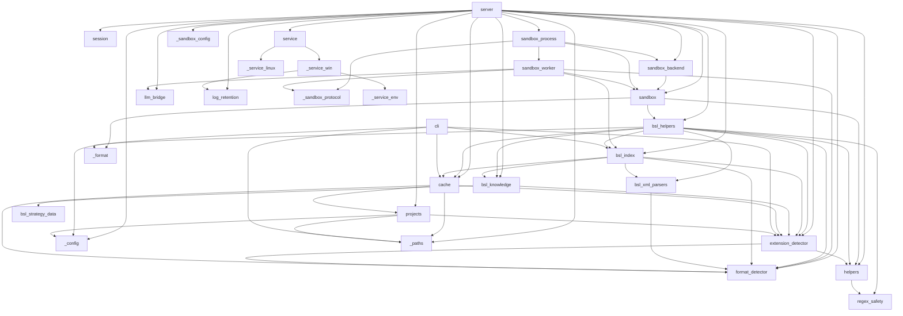

# Карта модулей

Актуально для **v1.29.1** (`BUILDER_VERSION = 14` — схема индекса НЕ менялась, пересборка индексов при обновлении не требуется).

Числа-снимки ниже застолблены тестами — если правишь сущность, обнови и число, и тест:

| Что | Значение | Где проверяется |
|---|---|---|
| Хелперов в песочнице (`_reg`) | **53** (discovery 8, code 12, xml 5, composite 7, business 15, extension 3, navigation 3) | `tests/test_start_cost_budget.py::test_helper_snapshot_count_locked` |
| Схема индекса | **v14**, 27 таблиц + FTS5 | `BUILDER_VERSION` в `bsl_index.py` |
| Бизнес-домены / алиасы (`rlm_help(topic=…)`) | **16** доменов, **116** алиасов | `_BUSINESS_RECIPES` / `_RECIPE_ALIASES` |
| Секции стратегии (`rlm_help(section=…)`) | **5** (+ виртуальная `disambiguation`) | `tests/test_strategy_data.py::test_strategy_sections_keys` |
| Пары DISAMBIGUATION | **11** | `tests/test_strategy_data.py::test_disambiguation_pairs_count` |

## Группы модулей

### Точки входа
- **`__init__.py`** — маркер пакета (только docstring; `__version__` в нём НЕТ — версия берётся из метаданных дистрибутива, см. `importlib.metadata` в `cli.py`).
- **`__main__.py`** — `python -m rlm_tools_bsl` → `server.main`.
- **`cli.py`** — CLI `rlm-bsl-index index build|update|info|drop`. Флаги сборки (`--no-calls`/`--no-metadata`/`--no-fts`/`--no-synonyms`) → опциональные таблицы индекса. `info`/`build`/`update` репортят недострой через `index_incomplete` / `stats_indicate_load_failure`. → `bsl_index`, `cache`, `extension_detector`, `_config`, `_paths`
- **`server.py`** — MCP-сервер (FastMCP). Тулы: `rlm_projects`, `rlm_index`, `rlm_start`, `rlm_execute`, `rlm_end` **+ `rlm_help`** — последний регистрируется УСЛОВНО (`if get_strategy_mode() == "slim":` вокруг `@mcp.tool()`), поэтому при `RLM_STRATEGY_MODE=full` его нет ни в манифесте FastMCP, ни в namespace модуля. Диспетчер `_rlm_help_dispatch(...)` — 6 режимов по приоритету (menu → topic → disambiguation → section → helpers → category) + `warnings: list[str]` при конфликте аргументов; данные тянет из `bsl_knowledge` (`_get_*`, `list_topics/sections/categories`, `_fuzzy_suggest`) и `bsl_helpers.build_helper_metadata_snapshot()`. `rlm_start.index` несёт машинный `index_status` (`ok`/`stale_age`/`stale_content`/`missing`/`incomplete`) и `nearby_extensions` (+ companion-поля усечения). Освобождение ресурсов эвикченных сессий — через `session_manager.on_evict = _release_session_resources`. На старте `main()` чистит `server.log` по времени (`log_retention`, пропускается под `RLM_UNDER_SERVICE` — там это делает служба) и переводит std-потоки в UTF-8 (Windows). В лог `rlm_execute` пишется сам код агента (`code=<…>`, `RLM_LOG_EXECUTE_CODE`). **v1.29.0**: `_sandboxes` хранит backend-объекты (`InlineSandboxBackend`/`ProcessSandboxBackend`), а не `Sandbox`; server больше НЕ читает `sandbox._namespace` — metadata (registry snapshot/prefixes/has_llm_tools) идёт через backend; фабрика `_create_session_backend` выбирает режим один раз на `rlm_start` (`RLM_SANDBOX_MODE`; невалидный = fail-fast в `main()` через `validate_sandbox_env` и controlled error в `_rlm_start`); `_rlm_execute` целиком под `session.execution_lock` (два execute одной сессии последовательны; `_sandboxes_lock` на время выполнения не держится) + монотонный sync `llm_calls_used` из backend + прокидка `sandbox_state` в ответ; `_rlm_end`/eviction — двухфазный detach → `request_close` → singleton `_reaper` (без ожиданий в caller); `main()` оборачивает `mcp.run` в try/finally с `_shutdown_all_sandbox_backends()` — ЕДИНЫЙ deadline `RLM_SANDBOX_SHUTDOWN_DEADLINE_SECONDS` на все workers, затем force-kill; временный parent `IndexReader` в process-режиме закрывается сразу после init worker (долгоживущий reader только в worker), `_idx_readers`-map удалён (reader inline-сессии принадлежит backend-у). → `session`, `sandbox`, `sandbox_backend`, `sandbox_process` (lazy), `_sandbox_config`, `llm_bridge`, `format_detector`, `extension_detector`, `bsl_knowledge`, `bsl_index`, `cache`, `projects`, `service`, `helpers`, `bsl_helpers`, `log_retention`, `_config`, `_paths`

### Сессии и песочница
- **`session.py`** — `Session` / `SessionManager`, двухуровневый TTL (idle/active), `build_session_manager_from_env()`, опциональный хук `on_evict` (сервер по нему делает detach backend + `request_close` + постановку в reaper). **v1.29.0**: у `Session` появился `execution_lock` (RLock) — сериализация двух `rlm_execute` одной сессии; teardown-пути (`rlm_end`/eviction/shutdown) его НИКОГДА не берут. → _(нет внутренних зависимостей)_
- **`sandbox.py`** — `Sandbox`: exec Python-кода агента в урезанном окружении с хелперами. **AST-гейт** (`_BLOCKED_DUNDERS`/`_BLOCKED_ACCESS`, запрет присваивания атрибутов, урезанные builtins) — базовая защита от инжекций, **НЕ security-граница** (честная формулировка границ — в `ARCHITECTURE.md`). `_wrap_helpers` — session-wide anti-duplicate detection; `_compute_efficiency_hints` — 4 нуджа (`read_files`, `reuse_var`, `batch`, `redundant_get_index_info`), каждый throttled один раз за сессию и живёт в метаданных ответа, не в stdout; `_add_error_hints` — подсказки на типичные ошибки (контракт `get_object_full_structure`, FileNotFoundError, TimeoutError, NameError, запрещённый import). Kwarg `extension_paths` передаётся ТОЛЬКО в `make_bsl_helpers(...)`; generic `make_helpers(...)` остаётся base-only — **sandbox-инвариант**: `read_file`/`grep`/`glob_files` не выходят за корень базы. **v1.29.0**: `BoundedTextCapture` — лимит stdout в СИМВОЛАХ в момент `write()` (не post-hoc срез; маркер `... [output truncated]` байт-в-байт прежний); instance `_execute_lock` + module-level `_INLINE_STDOUT_LOCK` — глобальная сериализация inline-exec закрывает stdout-гонку `redirect_stdout` (в process-режиме конкуренции нет — один Sandbox на процесс); `output_capture_factory` — точка подмены capture на shared-buffer writer worker-а; `registry_metadata_snapshot()` — JSON-safe срез registry сессии без `fn` (фильтрация каталога `build_helper_metadata_snapshot()` по фактическим ключам, хелпер вне каталога = init error); старый signal/`PyThreadState_SetAsyncExc`-таймаут остался только как inline-fallback (`execution_timeout_seconds=0` в worker — авторитетный deadline у родителя). → `helpers`, `bsl_helpers`, `_format`

### Процессная изоляция песочницы (v1.29.0)
- **`_sandbox_config.py`** — leaf: разбор/валидация env `RLM_SANDBOX_*` (`get_sandbox_mode`, timeouts, memory/IPC/code лимиты, `validate_sandbox_env()` для fail-fast в `server.main()`). Невалидное значение = `SandboxConfigError`, никогда не молчаливый fallback (опечатка в `RLM_SANDBOX_MODE` не может отключить изоляцию). → _(нет внутренних зависимостей)_
- **`_sandbox_protocol.py`** — leaf: IPC-кодек parent↔worker. UTF-8 JSON поверх `send_bytes`/`recv_bytes(maxlength)`; каждый frame несёт `protocol_version`/`type` (allowlist по направлению и состоянию)/`request_id`/`generation`; `encode_frame`/`decode_frame` (размер, UTF-8, JSON-объект, глубина ≤32), `validate_message`, `bounded_text` (cap диагностики). Pickle для runtime-сообщений от запущенного worker запрещён by design. → _(нет внутренних зависимостей)_
- **`sandbox_backend.py`** — backend-слой, с которым работает `server.py` вместо голого `Sandbox`: `BackendExecutionResult` (+ `sandbox_state`-маркеры terminated/restarted), `CloseReport`, ошибки `SandboxClosedError`/`SandboxStartupError`, `LlmQuota` (inline: single +1 / batch атомарно +N, all-or-nothing). **`InlineSandboxBackend`** — обёртка текущего `Sandbox` в том же процессе (диагностика/unsafe fallback; владеет переданным `IndexReader`, ставит LLM-wrappers eager как раньше). **`SandboxBackendReaper`** — единственный владелец завершающей фазы lifecycle: неблокирующая FIFO + pending-set + один daemon-thread; `rlm_end`/eviction только делают detach+`request_close`+enqueue, ожидание graceful/join/force-kill — здесь (двухфазный close: `request_close(reason)` мгновенный revoke → `finish_close(deadline)` bounded). → `sandbox`
- **`sandbox_worker.py`** — МАЛЕНЬКИЙ top-level spawn-target (не импортирует `server`): отвязка raw fd 0/1/2 от родителя ДО команд (MCP stdio framing неуязвим для raw-write), POSIX `setsid`; Linux hard orphan-guard через `PR_SET_PDEATHSIG` от стабильного spawn-broker thread, прочий POSIX — best-effort daemon-watchdog по `getppid`; ожидаемый PID сервера приходит trusted bootstrap-параметром и закрывает гонку до установки guard; затем `RLIMIT_AS`; recv/validate `init` → реконструкция `FormatInfo` → СОБСТВЕННЫЙ read-only `IndexReader` (недоступный индекс НЕ валит init — live/no-index + warning) → `Sandbox(execution_timeout_seconds=0, output_capture_factory=SharedStdoutWriter)` → lazy LLM probe (env+`find_spec`, без импорта `llm_bridge`; client создаётся при первом вызове, поздняя ошибка = bounded error без расхода quota) → `init_ok` (registry snapshot, prefixes, index_loaded, has_llm_tools) → последовательный command loop (execute/ping/shutdown). **`SharedStdoutWriter`** — пишет UTF-8 прямо в shared buffer, считает символы writer-side, публикует `published_bytes` ПОСЛЕ копирования байт (по целым UTF-8 символам) — частичный stdout доступен родителю после kill; `execute_result` stdout НЕ содержит. Quota-counter/lock приходят bootstrap-handles, не JSON. → `_sandbox_protocol`, `sandbox`, `bsl_index`, `format_detector`, `llm_bridge` (lazy)
- **`sandbox_process.py`** — **`ProcessSandboxBackend`** (production-цель): spawn-процесс на сессию через `get_context("spawn")`; на Linux короткий `Process.start()` сериализует daemon spawn-broker thread (init workers остаётся параллельным), чтобы worker `PDEATHSIG` был привязан к стабильному thread процесса сервера; ожидание ограничено общим startup deadline, timed-out broker перестаёт принимать запросы, новый broker снимает shared-fate, а старый владеет cleanup возможного позднего spawn. Windows Job Object (ctypes, `KILL_ON_JOB_CLOSE` + memory + active-process limit; невозможность создать/назначить = controlled ошибка `rlm_start`, weak-режима нет), POSIX process-group kill. Авторитетный deadline execute у родителя: по истечении — kill tree, bounded join, чтение частичного stdout из shared buffer (clamp к mapping), маркер `... [execution terminated after timeout; partial output]`, state `dead` + lazy restart на следующем execute (новое поколение, новый quota-counter И новый lock, `sandbox_state` restarted в первом ответе). LLM quota — aligned 32-bit shared counter: резерв ДО provider call переживает kill; после kill parent читает raw value БЕЗ старого lock, монотонно (`max`), clamp 0..max. Protocol violation / oversized result / worker_error → kill worker + controlled error одной сессии. `ProcessBackendConfig` (+`from_env`), `format_info_to_payload`. → `_sandbox_protocol`, `sandbox`, `sandbox_backend`, `sandbox_worker`

### BSL-логика
- **`bsl_helpers.py`** — **53 хелпера** для анализа BSL/1С, регистрируются через `_reg(name, fn, sig, cat, kw, recipe)` внутри замыкания `make_bsl_helpers(base_path, idx_reader, extension_paths=[])`; `build_helper_metadata_snapshot()` — lazy + thread-safe срез реестра `{name: {sig, cat, kw, recipe}}` БЕЗ активной сессии (через stub-callbacks), его читает диспетчер `rlm_help`. Ключевые группы:
  - **Композиты (снижают число `rlm_execute`)**: `get_object_profile(name, sections, include_flow, include_code_usages, limit)` — обзор объекта за 1 вызов (structure/modules/registers/subscriptions/roles/functional_options в едином `{status, summary, items, _meta}`); identity резолвится однократно, data-секции идут через **exact**-методы ридера (`get_roles_exact(include_members=True)`, `get_event_subscriptions_exact`, `get_functional_options_exact`), а не через substring-матч. `get_object_full_structure(name)` — XML-сторона (реквизиты + предопределённые + значения перечислений). `get_object_modules(name, include_methods=False)` — код-сторона: все модули объекта + дерево `#Область` + флаги перехватов, на валидном индексном пути НЕ читает тела и НЕ парсит XML.
  - **Граф вызовов**: `find_call_hierarchy` (exact-режим по `module_hint`, node-budget `_HIERARCHY_VISITED_CAP=2000`, opt-in `include_triggers`), `find_path` (реверс-BFS по callers; на многозначном имени без hint — мгновенный `{error, hint, candidates}` вместо патологического обхода), `find_data_path` (BFS по `metadata_references`, свой бюджет `_DATA_PATH_NODE_BUDGET=400`), `find_definition`, `find_callers`/`find_callers_context`.
  - **Расширения (visibility)**: `_ext_resolve_safe` — multi-root резолвер (`base + *extension_paths`, иначе `PermissionError`), `_ext_read_file` — читатель с отдельным кэшем ext-файлов; `_ensure_index` = `_load_main_into_index_state()` + `_load_extensions_into_index_state()` (**extension pass ВСЕГДА после main** — иначе ext-модули невидимы в idx_reader-сессиях). High-level хелперы видят объекты и модули расширений, пути возвращаются с префиксом `../cfe/…`; generic `read_file`/`grep`/`glob_files` — нет (см. sandbox-инвариант). Локатор XML/MDO расширений переиспользует `bsl_index._iter_metadata_xml_files` — **DRY-инвариант с индексером**.
  - **Live-слой поверх индекса**: `_live_search_*` дополняют индексные результаты данными расширений (shape зеркалит `IndexReader`); `extract_procedures` делает opportunistic live-fill пропущенных индексом методов; `_parse_procedures` склеивает multiline-сигнатуры общим `bsl_knowledge._merge_proc_continuations`.
  - **Сигналы и агрегаты (v1.27–v1.28)**: `_live_posting_signal` + `_live_code_only` + `_POSTING_HANDLER_DECL_RE` + `_MOVEMENTS_LIVE_RE` проверяют по одному живому телу обработчик и отсутствие выполняемых прямых `Движения.X`/`RegisterRecords.X`. `_RECORD_SET_RE` понимает русские и английские пространства регистров и фабрики; `_DOTLESS_NOISE` исключает булевы операторы и raise-конструкции. `find_register_movements` и секция `registers` профиля используют этот анализатор; compact-профиль переводит продолжение в подробный маршрут с offset 0. `_overrides_payload` — агрегаты `get_overrides` (`by_annotation`/`by_object_top`/`by_extension_top`/`unique_*`) по ПОЛНОМУ набору, а не по срезу 200. `_normalize_object_ref` канонизирует и русские runtime-формы ссылок (`ДокументСсылка.`/`ПеречислениеСсылка.` → `Document.`/`Enum.`).
  - **Прочее**: list-перегрузки `read_procedure`/`find_callers_context`/`find_enum_values` (`str|list` → dict-by-name через `_single_or_map`); `extract_procedures`/`get_module_outline` принимают имя ИЛИ путь (`_looks_like_path` + `_resolve_module_arg` + `_module_rank`); `safe_grep` — ReDoS-guard + чистый `ValueError` на битом regex + POSIX-нормализация `file`; `git_search` — полнотекст через `git grep`; sandbox-хелпер `help('keyword')` (`bsl_help`) — code-time-справка, доступна в ОБОИХ режимах стратегии (не путать с MCP-тулом `rlm_help`).

  → `format_detector`, `bsl_knowledge`, `bsl_index` (`_make_callee_key`, `_scan_module`, `_MOVEMENT_METHOD_NOISE`; lazy — `_collect_object_synonyms`, `_iter_metadata_xml_files`, `_git_grep`), `cache`, `bsl_xml_parsers`, `extension_detector`, `helpers` (`_SKIP_DIRS`), `regex_safety`, `_format`
- **`bsl_knowledge.py`** — стратегия анализа + BSL-паттерны. Router `get_strategy(...)` диспетчерит по `RLM_STRATEGY_MODE` (`slim` по умолчанию, `full` — legacy, невалидное значение → `slim`) в `_build_slim_strategy(...)` / `_build_full_strategy(...)`. Slim собирает компактную маршрутную карту (preamble + `STRATEGY_SECTIONS["critical"]` + указатель на `rlm_help` + workflow-обзор + auto-routed compact-рецепт + `build_slim_helpers_index(registry)` + указатель на disambiguation + `STRATEGY_SECTIONS["batching"]` + `_render_index_block(...)`), full — весь текст инлайном. **16 бизнес-доменов** (`_BUSINESS_RECIPES`; у каждого — `compact` и `full`, у 7 дополнительно `code_hint`), **116 алиасов** (`_RECIPE_ALIASES`), **7 категорий** хелперов (`_CATEGORY_ORDER`). Dispatcher-API для `rlm_help`: `_get_section`, `_get_disambiguation`, `_get_category_helpers`, `_get_topic_recipe`, `_get_helper_details`, `_fuzzy_suggest`, `list_topics/list_sections/list_categories`, `get_strategy_mode`. Динамический `_extension_strategy(ctx, overrides)` — token-bounded блок CRITICAL EXTENSIONS (по умолчанию заголовок-счётчик + указатель на машиночитаемый `extension_context.nearby_extensions`; построчная детализация — только под `RLM_EXT_OVERRIDE_DETAIL>0`). `summarize_extensions_by_overrides(nearby, ext_overrides, cap)` — top-N по overrides с детерминированным тай-брейком (`RLM_EXT_LIST_CAP`, дефолт 20; режет ТОЛЬКО ветку MAIN, зовётся из `extension_detector._build_warnings`, `_extension_strategy` и `server._rlm_start`; `ext_context.nearby_extensions` и питание песочницы не трогает). Общие утилиты: `BSL_PATTERNS`, `_merge_proc_continuations(lines) -> (merged_lines, line_map)` (multiline-сигнатуры, string-literal-aware, hard-cap 20 строк / 2000 символов — используется и билдером, и `bsl_helpers`). → `bsl_strategy_data`, `extension_detector`
- **`bsl_strategy_data.py`** — leaf-модуль (только stdlib): `STRATEGY_SECTIONS` (5 ключей: `critical`, `workflow`, `performance`, `batching`, `io`) + `DISAMBIGUATION_PAIRS` (11 пар `{pair, summary, when_a, when_b, rule, tags}`) для `rlm_help(section=…)`. Намеренно НЕ импортирует `bsl_knowledge`/`bsl_helpers` — нет циркулярки. → _(нет внутренних зависимостей)_
- **`bsl_index.py`** — SQLite-индекс **v14**: `_SCHEMA_SQL` + опциональные `form_elements`/`methods_fts` = **27 таблиц + FTS5** (core×4: `index_meta`/`modules`/`methods`/`calls`; metadata×17; navigation×1 `file_paths`; references×4: `metadata_references`/`exchange_plan_content`/`defined_types`/`characteristic_types`; code-usages×1 `metadata_code_usages`). Два класса: `IndexBuilder` и `IndexReader`.
  - **Сборка**: git fast path + pointwise incremental refresh (per-object DELETE+INSERT для основных категорий, soft-thresholds + bulk fallback для остального). Полная пересборка идёт **на месте** (DROP всего кроме `index_meta` → `_SCHEMA_SQL` → populate), без `unlink`/`rename` — иначе `PermissionError` под открытым reader'ом на Windows; окно прикрыто маркером `index_meta.build_in_progress` (снимается единым success-gate после `ANALYZE`/`VACUUM`), недострой виден через `index_incomplete` / `stats_indicate_load_failure`. `_BuildLock` — thread-aware (реентрантность только для того же потока).
  - **Граф вызовов**: каждое ребро резолвится в стабильный `callee_key = "<rel_path>::<casefold(метод)>"` (`_make_callee_key` — единый источник для build и query) по двум tier'ам — local (`B()`) и common_exported (`A.B()` через `_build_common_exported`); неоднозначные/платформенные → `NULL` by design. `_reresolve_qualified_callers` держит инвариант `update ≡ build` по `callee_key`. Перф: выражение-индексы `idx_calls_callee_short`/`idx_calls_callee` (единый источник `_callee_short_expr`/`_callee_match_clause`) + FK-индекс `idx_meth_module`, оба с безусловным self-heal в `_update_locked`.
  - **Чтение (read-only слой поверх схемы)**: `get_callers` (+`edge_exact`), `get_inbound_edges` (не-call рёбра: подписки, регламентные задания, обработчики форм, CFE-перехваты — в общем пространстве `callee_key`), `resolve_target_identity`, `find_metadata_refs_from`, `sample_method_definitions` (дешёвая проба многозначности имени для ambiguity-guard `find_path`), exact-ридеры (`get_roles_exact`/`get_event_subscriptions_exact`/`get_functional_options_exact`) и счётчики (`count_regions`/`count_module_headers`/`count_metadata_references`/`count_code_usages`/`count_overrides_by_extension_root`). Read-time фильтр шума в `get_register_movements`/`get_register_writers` (`_MOVEMENT_METHOD_NOISE` — `Движения.Записать()` и прочие методы набора не выдаются за регистры даже на старом индексе, без пересборки). Кириллица в substring-поиске — через `py_lower(col) LIKE py_lower(?)`, а не `COLLATE NOCASE` (тот фолдит только ASCII). Декоратор `@_transient_safe` гасит ДВА транзиентных `OperationalError` in-place пересборки (`no such table`, `database is locked`) и ре-raise'ит всё остальное.
  - **Общее с хелперами**: `_scan_module` (multiline/comment/string-aware сканер — используется и в FS-fallback `bsl_helpers`), `_iter_metadata_xml_files` (path-scan XML/MDO — DRY с extension pass `bsl_helpers`), `_git_grep` + санитайзеры (`_sanitize_grep_path` нормализует внутренний backslash, режет ведущие `/`/`\`, drive/glob/`..`/UNC).

  → `bsl_knowledge` (`BSL_PATTERNS`, `_merge_proc_continuations`), `cache`, `format_detector`, `bsl_xml_parsers`, `extension_detector`
- **`bsl_xml_parsers.py`** — парсеры XML-метаданных 1С, **оба формата (CF и EDT)** за общим фасадом (`parse_metadata_xml` → `dict | None`, `parse_form_xml`, `parse_rights_xml`, `parse_event_subscription_xml`, `parse_scheduled_job_xml`, `parse_enum_xml`, `parse_predefined_items`, `parse_functional_option_xml`, `parse_http_service_xml`, `parse_web_service_xml`, `parse_xdto_package_xml`/`parse_xdto_types`, `parse_exchange_plan_content`, `parse_defined_type`, `parse_pvh_characteristics`, `parse_command_parameter_type`, `canonicalize_type_ref`, `normalize_type_string`). `_RU_META_FORMS` — единый источник RU/EN форм метаданных + производные карты (`_CODE_MANAGER_COLLECTIONS`/`_CODE_QUERY_COLLECTIONS`/`_RU_REFTYPE_TO_CANONICAL`) для code-usage-экстрактора; leaf → импортируется и в `bsl_index`, и в `bsl_helpers` без циклов. → `format_detector`

### Детектирование формата
- **`format_detector.py`** — определение CF/EDT (`detect_format`, `SourceFormat`, `FormatInfo`), парсинг путей BSL-файлов (`parse_bsl_path`, `BslFileInfo`), `METADATA_CATEGORIES`, `MODULE_TYPE_MAP`. → _(нет внутренних зависимостей)_
- **`extension_detector.py`** — обнаружение расширений 1С и перехватов методов: `ConfigRole` (MAIN/EXTENSION), `ExtensionContext`, `detect_extension_context`, `resolve_config_root`, `find_extension_overrides` (скан `&Вместо/&Перед/&После/&ИзменениеИКонтроль`; опциональные diagnostics фиксируют неполный обход и нечитаемые BSL-файлы), `_build_warnings`, `_ext_list_cap`. → `format_detector`, `helpers`

### Инфраструктура
- **`helpers.py`** — generic-тулбокс песочницы (не BSL-специфичный): `make_helpers(base_path, idx_reader=None)` → `read_file`, `read_files`, `grep`, `grep_summary`, `grep_read`, `glob_files`, `tree`, `find_files` + резолвер `_resolve_safe` (base-only). Кэши файлов/грепа, `_SKIP_DIRS`/`_BINARY_EXTENSIONS` (переиспользуются `extension_detector`, `bsl_helpers`, `server`), индексные fast-path'ы через `idx_reader` с FS-fallback на zero-hit. → `regex_safety`
- **`regex_safety.py`** — leaf-guard против catastrophic backtracking (ReDoS): `has_catastrophic_nesting(pattern)` + общий текст ошибки `NESTED_QUANTIFIER_ERROR`. Зовётся ПЕРВЫМ действием на ОБОИХ входах grep (`helpers.grep`, `bsl_helpers.safe_grep`) — до кэша/`re.compile`/прогрева индекса. Эвристика по СТРУКТУРЕ (вложенные неограниченные кванторы), не полноценный wall-clock-kill: bounded-кванторы (`(\d{4})+`) не блокируются. → _(нет внутренних зависимостей)_
- **`log_retention.py`** — leaf: ротация `server.log` по ВРЕМЕНИ на старте (`purge_log_older_than`, окно `RLM_LOG_RETENTION_DAYS`, дефолт 20; `log_retention_days()`). Лог append-only и хронологический → достаточно одной точки среза. Работает на БАЙТАХ с ASCII-регексом (хвост переписывается verbatim — старые логи смешанной кодировки не портятся), понимает timestamp watchdog-строк службы, перезапись атомарная (temp + `os.replace`), **никогда не бросает исключений**. Должен вызываться ДО открытия файла писателем: на Windows — из службы (`_service_win`), иначе — из `server.main()`. → _(нет внутренних зависимостей)_
- **`cache.py`** — дисковый кеш BSL-файлов (`load_index`/`save_index`, root зависит от `RLM_INDEX_DIR`/`RLM_CONFIG_FILE`/`~/.cache`, см. `docs/INDEXING.md`), `touch_project_cache`, `purge_project_cache` (зовётся из `rlm_index(action='drop')` — иначе кеш оставался осиротевшим), `cleanup_stale_cache`, `_paths_hash`. → `format_detector`, `extension_detector`, `projects`, `_paths`
- **`llm_bridge.py`** — LLM-клиент для `llm_query` в песочнице: нативный Anthropic (`get_client`, `make_llm_query`) ИЛИ OpenAI-совместимый эндпоинт (`_make_openai_query`) — выбор в `get_llm_query_fn()` по env; `make_llm_query_batched` (пул + батчинг), `warmup_openai_import`. → _(нет внутренних зависимостей)_
- **`projects.py`** — реестр проектов (`ProjectRegistry`, `projects.json`: name → path, опциональный пароль, fuzzy-подсказка по `_levenshtein`, `RegistryCorruptedError`). → `_config`, `extension_detector`, `_paths`
- **`_config.py`** — конфигурация: `CONFIG_DIR`/`SERVICE_JSON`, `get_projects_path()`, `load_project_env()` (поиск `.env` в т.ч. через `service.json`). → _(нет внутренних зависимостей)_
- **`_format.py`** — presentation-слой: `number_lines(text, start)`. → _(нет внутренних зависимостей)_
- **`_paths.py`** — каноникализация путей (`canonicalize_path`, резолв mapped-дисков/path-map). Используется `server`, `projects`, `cache`, `cli`. → _(нет внутренних зависимостей)_

### Сервис
- **`service.py`** — фасад управления службой: `handle_service_command(args)` (install / uninstall / start / stop / status) + общий конфиг (`CONFIG_FILE`, `load_config`, `save_config`) → лениво импортирует платформенную реализацию.
- **`_service_win.py`** — Windows-служба через pywin32 (`RlmWindowsService`, install/uninstall/start/stop/status, watchdog + health-check, редирект stderr дочернего процесса в `server.log`). Чистит `server.log` (`log_retention`) ДО открытия файла на запись и ставит дочернему `RLM_UNDER_SERVICE`/`PYTHONUTF8`. → `_service_env`, `service`, `log_retention`
- **`_service_linux.py`** — systemd `--user`-юнит. → `service`
- **`_service_env.py`** — чистые (без pywin32) утилиты окружения службы: `build_service_pythonpath`, `build_service_env_vars`. Вынесены отдельно, чтобы unit-тесты шли на любой платформе, включая CI без service-группы зависимостей. → _(нет внутренних зависимостей)_

## Граф зависимостей

Замечание по группе «Сервис»: связь `service` ↔ `_service_win`/`_service_linux` **двусторонняя** — фасад лениво (внутри функции) импортирует платформенные команды, а платформенные модули на уровне модуля импортируют из `service` конфиг-утилиты (`load_config`/`save_config`/`_config_path`). Цикла на импорте нет именно из-за ленивости фасада. На графе показано только направление фасада.

## Синхронизация текста стратегии между двумя режимами

Текст стратегии живёт в **двух источниках**: `_STRATEGY_HEADER` / `_STRATEGY_IO_SECTION` в `bsl_knowledge.py` обслуживают `RLM_STRATEGY_MODE=full` (полный inline-текст), а `STRATEGY_SECTIONS` + `DISAMBIGUATION_PAIRS` в `bsl_strategy_data.py` — slim-режим через MCP-тул `rlm_help(section=…)`. Источники разделены из-за различий порядка Step 5 и представления правил DISAMBIGUATION; их согласованность контролируют тесты-tripwire.

**Что синхронить при правке текста:**

| Что меняешь | Место для full-режима | Место для slim (`rlm_help`) |
|---|---|---|
| Текст `Step 0..5` (WORKFLOW) | `_STRATEGY_HEADER` (блок `== WORKFLOW ==`) | `STRATEGY_SECTIONS["workflow"]` |
| Блок `STEP 4 EXTENDED` (INSTANT/HYBRID/LIVE) | `_STRATEGY_HEADER` (блок `== STEP 4 EXTENDED ==`) | `STRATEGY_SECTIONS["performance"]` |
| Блок `BATCHING & OUTPUT` | `_STRATEGY_HEADER` (блок `== BATCHING & OUTPUT ==`) | `STRATEGY_SECTIONS["batching"]` |
| Блок `CRITICAL` | `_STRATEGY_HEADER` (блок `== CRITICAL ==`) | `STRATEGY_SECTIONS["critical"]` |
| Блок `File I/O` + LLM | `_STRATEGY_IO_SECTION` | `STRATEGY_SECTIONS["io"]` |
| Правила `== DISAMBIGUATION ==` | `_STRATEGY_HEADER` (блок `== DISAMBIGUATION ==`) | `DISAMBIGUATION_PAIRS` (структурированный список) |
| **Step 5 EXTENSIONS** — high-level хелперы и `PermissionError` для `read_file`/`grep`/`glob_files` на `../`-путях | `_STRATEGY_HEADER` (Step 5) **+ динамический `_extension_strategy(ctx, overrides)` + рецепт `расширения` в `_BUSINESS_RECIPES` + NOTE в `_reg("get_overrides", …)`** | `STRATEGY_SECTIONS["workflow"]` (Step 5) |
| **Нудж «не зови `get_index_info()` на старте»** | `_STRATEGY_HEADER` (BATCHING) **+ шапка динамического `_render_index_block(...)`** — нудж живёт рядом с данными, которые он замещает | `STRATEGY_SECTIONS["batching"]` |

**Публичный контракт хелпера и agent-facing тексты синхронизируются как единое целое.** При изменении ключей, параметров или интерпретации результата одновременно обновляются `recipe` в `_reg(...)`, соответствующий домен в `_BUSINESS_RECIPES` (формы `compact` и `full`), обе копии стратегии и `docs/full_analysis_prompt.md`. Дефолтный маршрут агента должен описывать тот же контракт, что и production-хелпер.

**Что синхронить НЕ нужно** (живёт в одном месте, оба режима читают через общий API):
- бизнес-рецепты — `_BUSINESS_RECIPES` в `bsl_knowledge.py`;
- алиасы доменов — `_RECIPE_ALIASES`;
- хелперы и их per-helper recipes — `_reg(name, fn, sig, cat, kw, recipe)` в `bsl_helpers.py`;
- категории — `_CATEGORY_ORDER`.

**Защита от забытого синка** — `tests/test_strategy_data.py`:
- `test_strategy_sections_did_not_drift_from_legacy` — маркеры `== CRITICAL ==`, `Step 0 — UNDERSTAND`, `== STEP 4 EXTENDED`, `== BATCHING & OUTPUT ==`, `File I/O:` + фраза `"to high-level BSL helpers"` и слово `"PermissionError"` есть в ОБЕИХ копиях. Подменишь блок целиком — заметит; переформулируешь строку внутри — пропустит;
- `test_get_index_info_nudge_strengthened_and_synced_slim_and_full` / `test_index_block_colocates_get_index_info_nudge` — нудж про `get_index_info` синхронен в обеих копиях BATCHING и присутствует в INDEX-блоке;
- `test_strategy_text_full_mentions_extension_helpers` / `test_strategy_sections_slim_mentions_extension_helpers` / `test_rlm_help_topic_extensions_does_not_suggest_read_file_on_ext_paths` / `test_extension_critical_block_mentions_new_phrasing` — `read_procedure`, `extract_procedures`, `parse_object_xml`, `find_predefined` упомянуты во всех четырёх местах (slim / full / динамический блок / рецепт);
- `tests/test_strategy_mode_env.py::test_router_full_matches_legacy_builder` — router `get_strategy(...)` под `RLM_STRATEGY_MODE=full` идентичен прямому вызову `_build_full_strategy(...)`;
- `tests/test_start_cost_budget.py` — бюджет payload `rlm_start` (+5% к бэйслайну) и `test_helper_snapshot_count_locked`.

**При добавлении пары DISAMBIGUATION:** обновить `assert len(DISAMBIGUATION_PAIRS) == 11` в `tests/test_strategy_data.py::test_disambiguation_pairs_count` И зеркальный `assert len(res["result"]) == 11` в `tests/test_rlm_help.py::test_disambiguation_full`.

**При добавлении хелпера:** обновить `test_helper_snapshot_count_locked` (сейчас `== 53`) — добавление/удаление хелпера всегда намеренное.

**При добавлении бизнес-домена / категории хелпера:** обновить enum в `Field(description=…)` параметра `topic`/`category` у `rlm_help` ([server.py](../src/rlm_tools_bsl/server.py)) — это документация для агента. Сами значения берутся из `_BUSINESS_RECIPES` / `_CATEGORY_ORDER` динамически.
